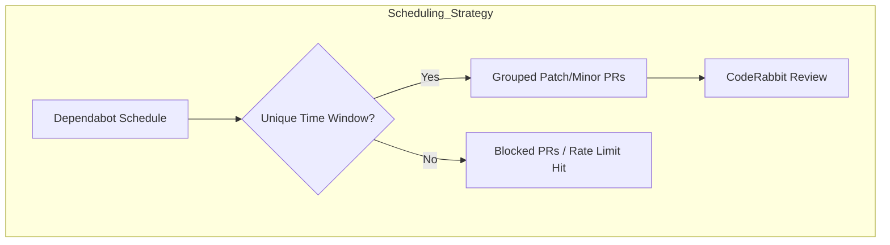
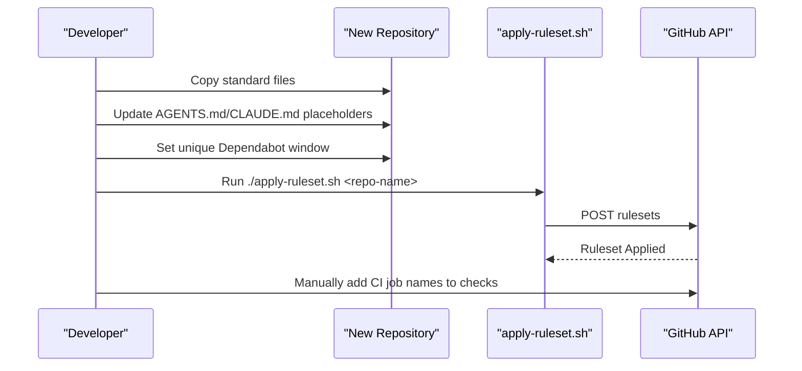

Relevant source files

The following files were used as context for generating this wiki page:

- [README.md](README.md)
- [SECURITY.md](SECURITY.md)
- [AGENTS.md](AGENTS.md)
- [CLAUDE.md](CLAUDE.md)
- [branch-ruleset-template.json](branch-ruleset-template.json)
- [apply-ruleset.sh](apply-ruleset.sh)

# Home

The `repo-standard` project serves as a "gold standard" template repository for the blixten85 organization. Its primary purpose is to provide a unified set of files, GitHub Actions workflows, and configuration templates that every repository within the organization should adopt. This ensures consistency across projects, covering licensing, security, AI agent instructions, and automated maintenance schedules.

Key features include pre-configured GitHub Actions for CI/automation, standardized security reporting protocols, and strict branch protection rulesets. By copying the provided templates, developers can avoid building repository foundations from scratch while adhering to organizational best practices for dependency management and code review.

Sources: [README.md:1-6](README.md#L1-L6), [SECURITY.md:1-5](SECURITY.md#L1-L5)

## Core Components and File Structure

The repository acts as a centralized source of truth for the organization's standard files. These include legal, security, and automation configurations.

| Filename | Purpose |
| :--- | :--- |
| `LICENSE` | MIT License implementation. |
| `SECURITY.md` | Standard vulnerability reporting policy. |
| `AGENTS.md` / `CLAUDE.md` | AI agent instructions and conventions. |
| `.coderabbit.yaml` | Configuration for CodeRabbit auto-review. |
| `.github/dependabot.yml` | Scheduled dependency updates. |
| `branch-ruleset-template.json` | JSON template for protecting the `main` branch. |

Sources: [README.md:8-18](README.md#L8-L18)

### AI Agent Integration
The repository includes specific guidance for AI agents (like Claude) to ensure they follow project-specific conventions. These instructions explicitly define what agents are allowed and forbidden to do, such as preventing agents from pushing directly to `main` or modifying secrets.

Sources: [AGENTS.md:1-25](AGENTS.md#L1-L25), [CLAUDE.md:1-10](CLAUDE.md#L1-L10)

## Automation and GitHub Workflows

The project defines 10 standard workflows located in `.github/workflows/` to handle core repository automation.

### Standard Workflows
- **Core Automation:** Includes `auto-commit.yml`, `auto-label.yml`, `auto-merge.yml`, `auto-rebase.yml`, and `auto-release.yml`.
- **Security & Analysis:** `codeql.yml` for static analysis and `security-alerts-sync.yml`.
- **Review Resilience:** `coderabbit-rewake.yml` is used to re-trigger CodeRabbit reviews if they are blocked by rate limits.
- **Claude Integration:** `claude-assign-trigger.yml` triggers responses based on the `ask-claude` label.

Sources: [README.md:22-30](README.md#L22-L30)

### Dependency Management & Scheduling
To prevent exceeding CodeRabbit's Pro-plan rate limits (5 reviews per hour across the organization), the project enforces strict scheduling for Dependabot updates.

Updates are consolidated into two primary windows (Wednesday and Saturday nights) to minimize competition with manual development hours.

Sources: [README.md:37-55](README.md#L37-L55)

## Branch Protection and Security

Security is managed through a combination of mandatory rulesets and a defined reporting policy.

### Branch Rulesets
The `branch-ruleset-template.json` defines strict requirements for the `main` branch, including:
- Mandatory pull request reviews (minimum 1 approval).
- Required status checks (CodeRabbit integration).
- Prevention of deletions and non-fast-forward pushes.
- Resolution of all review threads before merging.

Sources: [branch-ruleset-template.json:1-49](branch-ruleset-template.json#L1-L49)

### Security Reporting
Vulnerabilities are not to be reported via public issues. Instead, they are reported privately via email or the GitHub Security tab. The scope includes core transport layers (`SSHCore`), application code, and CI/CD workflows, but excludes third-party dependencies.

Sources: [SECURITY.md:3-35](SECURITY.md#L3-L35)

## Deployment Procedure

Deploying the standard to a new repository involves a specific sequence of manual and automated steps.

The `apply-ruleset.sh` script is explicitly designed to be run by a human operator, as branch protection modifications via API are blocked for AI agents within the organization.

Sources: [README.md:68-81](README.md#L68-L81), [apply-ruleset.sh:1-12](apply-ruleset.sh#L1-L12)

## Summary

The `repo-standard` repository provides the foundational infrastructure for all blixten85 projects. By centralizing workflow definitions, AI agent guidelines, and branch protection logic, it ensures that every repository maintains high security and automation standards while navigating external limitations like API rate limits.
