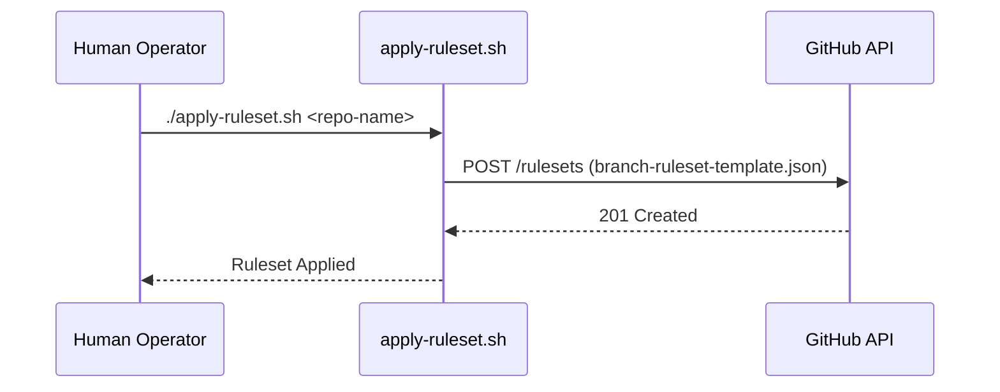

<details>
<summary>Relevant source files</summary>

The following files were used as context for generating this wiki page:

- [README.md](README.md)
- [apply-ruleset.sh](apply-ruleset.sh)
- [AGENTS.md](AGENTS.md)
- [CLAUDE.md](CLAUDE.md)
- [SECURITY.md](SECURITY.md)
- [branch-ruleset-template.json](branch-ruleset-template.json)
</details>

# Quickstart Guide for New Repositories

The `repo-standard` repository serves as a "gold standard" template for all repositories within the `blixten85` organization. It provides a foundational set of files, GitHub Actions workflows, and configuration templates designed to standardize project structure and automation, ensuring consistency across all new developments.

This guide outlines the mandatory steps for initializing a new repository, including the configuration of AI agent instructions, scheduling dependency updates to avoid rate limits, and applying standardized branch protection rules.

Sources: [README.md:1-6](README.md#L1-L6)

## 1. Initial Repository Setup

The first step in creating a new repository is to replicate the standard structure. All files from the `repo-standard` template should be copied to the new destination, excluding specific scripts that are intended only for the initial setup process.

### Included Standard Files
The following files must be present in every repository to ensure compliance with organization standards:

| File / Folder | Purpose |
| :--- | :--- |
| `LICENSE` | MIT License declaration. |
| `SECURITY.md` | Standard security policy and vulnerability reporting instructions. |
| `AGENTS.md` / `CLAUDE.md` | Instruction sets for AI agents (Claude Code, etc.). |
| `.coderabbit.yaml` | Configuration for CodeRabbit automated PR reviews. |
| `.github/dependabot.yml` | Configuration for automated dependency updates. |
| `.github/workflows/` | Core automation (10 standard workflows) including CodeQL and auto-releases. |

Sources: [README.md:8-16](README.md#L8-L16), [README.md:20-29](README.md#L20-L29)

## 2. Configuring AI Agent Instructions

New repositories must define their scope and conventions for AI agents. This involves updating placeholders in the `AGENTS.md` and `CLAUDE.md` files to reflect the specific project name and technical requirements.

### Agent Permissions and Restrictions
The `AGENTS.md` file defines a strict boundary for AI behavior to maintain repository integrity.

```mermaid
flowchart TD
    subgraph AllowedActions[Allowed Actions]
        A1[Create Branches]
        A2[Modify Code]
        A3[Run Tests]
        A4[Open PRs]
    end
    subgraph ForbiddenActions[Forbidden Actions]
        F1[Push to Main]
        F2[Merge PRs]
        F3[Modify Secrets]
        F4[Disable Workflows]
    end
    AI_Agent --> AllowedActions
    AI_Agent --X ForbiddenActions
```

*Logic flow showing what an AI agent is permitted to perform versus strictly prohibited actions.*

Sources: [AGENTS.md:7-24](AGENTS.md#L7-L24), [CLAUDE.md:1-7](CLAUDE.md#L1-L7)

## 3. Dependabot and CodeRabbit Rate-Limit Management

A critical constraint within the `blixten85` organization is the CodeRabbit review quota, which is limited to 5 reviews per hour across the entire organization. To prevent PRs from being permanently blocked by required status checks, each repository **MUST** have a unique `schedule` window in `.github/dependabot.yml`.

### Scheduling Windows
Dependabot updates are consolidated into Wednesday and Saturday nights. When adding a new repository, an operator must select an unoccupied 30-minute window with at least 1 hour of margin from other repositories.

| Repository | Scheduled Window |
| :--- | :--- |
| repo-standard | Wednesday 02:00–02:30 |
| ops-hub | Wednesday 01:00–01:30 |
| scraper | Wednesday 23:00–23:30 |

Sources: [README.md:31-62](README.md#L31-L62)

## 4. Branch Protection and Rulesets

Every repository must protect the `main` branch using a standardized ruleset. This ruleset enforces code reviews, status checks, and prevents destructive actions like force-pushing or branch deletion.

### Applying the Ruleset
The ruleset is applied using the `apply-ruleset.sh` script. This action **must** be performed by a human operator, as branch protection modifications are blocked for AI agents.



*Sequence of events for applying branch protection via the GitHub API.*

### Technical Configuration
The `branch-ruleset-template.json` enforces the following:
*  **Required Reviews:** At least 1 approving review.
*  **Merge Methods:** Only `squash` and `rebase` are allowed.
*  **Status Checks:** `CodeRabbit` is a mandatory check.
*  **Restrictions:** Non-fast-forward pushes and branch deletions are disabled.

Sources: [apply-ruleset.sh:1-12](apply-ruleset.sh#L1-L12), [branch-ruleset-template.json:1-50](branch-ruleset-template.json#L1-L50)

## 5. Security and Vulnerability Reporting

The `SECURITY.md` file defines how vulnerabilities are handled. The organization prioritizes private reporting over public issues.

### Reporting Process
1.  **Discovery:** Vulnerability found in code or GitHub workflows.
2.  **Private Report:** Email to `dev@denied.se` or via the GitHub Security tab.
3.  **Timeline:** Acknowledgment within 48 hours; assessment within 5 business days.

Sources: [SECURITY.md:1-24](SECURITY.md#L1-L24)

## Summary

The initialization of a new repository involves cloning the standard structure, configuring unique scheduling to manage organization-wide rate limits, and manually applying branch protection rules via the provided shell script. Following these steps ensures the repository is integrated into the automated CI/CD and AI-assisted review pipelines of the `blixten85` organization.

Sources: [README.md:76-85](README.md#L76-L85)
