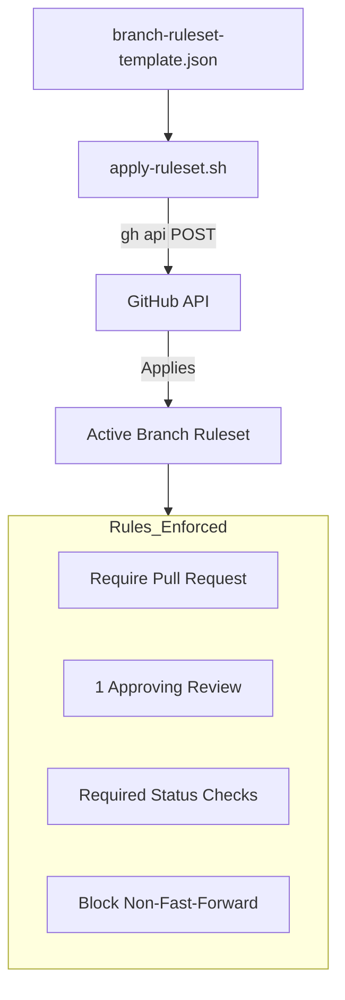
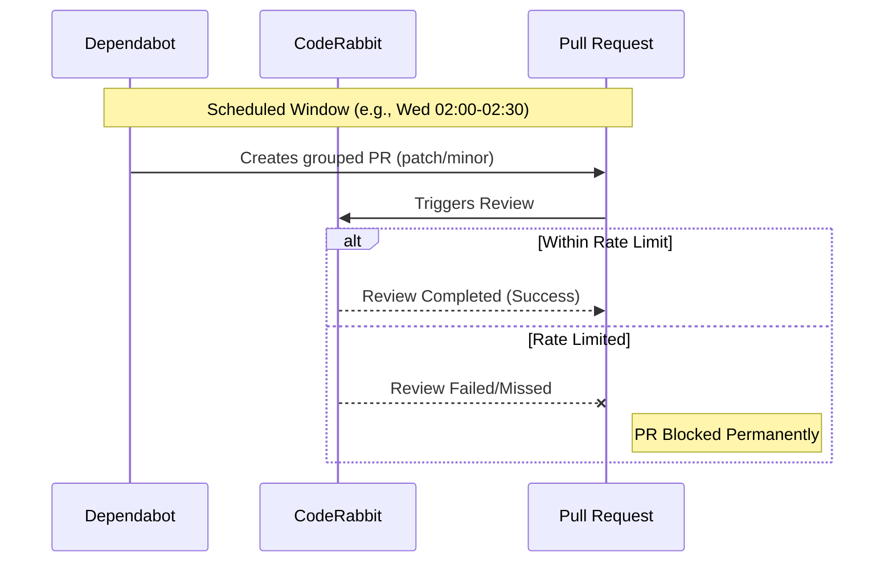

Relevant source files

The following files were used as context for generating this wiki page:

- [README.md](../../../README.md)
- [CLAUDE.md](../../../CLAUDE.md)
- [AGENTS.md](../../../AGENTS.md)
- [SECURITY.md](../../../SECURITY.md)
- [branch-ruleset-template.json](../../../branch-ruleset-template.json)
- [apply-ruleset.sh](../../../apply-ruleset.sh)

# Template Architecture & Philosophy

The `repo-standard` repository serves as a "gold standard" template for all projects within the blixten85 organization. Its primary purpose is to provide a unified set of files, workflows, and configuration templates to ensure consistency across repositories, reducing the need to build foundational infrastructure from scratch for every new project. 

The philosophy centers on automated maintenance, strict security standards, and AI-agent compatibility. By consolidating core automation—such as dependency updates, security scanning, and pull request reviews—the architecture minimizes manual overhead while enforcing high quality through required status checks and branch protection rules.

Sources: [README.md:1-6](../../../README.md#L1-L6), [README.md:16-24](../../../README.md#L16-L24)

## Core Architectural Components

The repository architecture is organized into several functional layers: documentation, automation (GitHub Actions), security, and administrative tooling.

### Repository Structure and Tooling

| Component | Purpose | Relevant Files |
| :--- | :--- | :--- |
| **Documentation** | Standards for human and AI contributors | `README.md`, `SECURITY.md`, `AGENTS.md`, `CLAUDE.md` |
| **Automation** | GitHub Actions for CI/CD and maintenance | `.github/workflows/*.yml`, `.github/dependabot.yml` |
| **Governance** | Branch protection and rule enforcement | `branch-ruleset-template.json`, `apply-ruleset.sh` |
| **Templates** | Standardized issue and PR formats | `.github/pull_request_template.md`, `.github/ISSUE_TEMPLATE/*` |

Sources: [README.md:8-14](../../../README.md#L8-L14), [README.md:16-24](../../../README.md#L16-L24)

### Branch Protection and Deployment Logic

The architecture utilizes GitHub Repository Rulesets to protect the `main` branch. This is implemented via a JSON template and a shell script that uses the GitHub CLI to apply rules programmatically.

The diagram shows how the branch protection configuration flows from a local template to the GitHub environment, enforcing specific quality gates.

Sources: [branch-ruleset-template.json:1-48](../../../branch-ruleset-template.json#L1-L48), [apply-ruleset.sh:1-12](../../../apply-ruleset.sh#L1-L12)

## AI Agent Integration Philosophy

A core tenet of the architecture is the explicit support and boundary-setting for AI agents (e.g., Claude Code, CodeRabbit). The project defines clear permissions and restrictions for these agents to ensure productivity without compromising security.

### Agent Guidelines and Constraints
The repository includes dedicated guides for AI agents (`AGENTS.md` and `CLAUDE.md`). These files establish a contract between the human maintainer and the automated agent.

*  **Allowed Actions**: Agents can create branches, modify code, run tests, and open PRs.
*  **Forbidden Actions**: Agents are strictly prohibited from pushing directly to `main`, merging PRs, modifying secrets, or changing organization settings.
*  **Security Barrier**: Branch protection changes are intentionally blocked for agents and must be performed manually by a human operator.

Sources: [AGENTS.md:11-20](../../../AGENTS.md#L11-L20), [apply-ruleset.sh:2-4](../../../apply-ruleset.sh#L2-L4), [README.md:11-12](../../../README.md#L11-L12)

## Automation Strategy and Rate-Limit Management

The architecture includes a sophisticated strategy for managing GitHub Actions and third-party review tools like CodeRabbit to avoid resource exhaustion and permanent PR blockages.

### CodeRabbit Rate-Limit Mitigation
CodeRabbit reviews are a "required status check," meaning a failure to review blocks a merge. Since the organization shares a quota (5 reviews per hour), the architecture employs a distributed scheduling strategy in `dependabot.yml`.

This sequence illustrates the necessity of the "Window" approach to prevent multiple repositories from triggering reviews simultaneously.

Sources: [README.md:27-41](../../../README.md#L27-L41), [README.md:43-58](../../../README.md#L43-L58)

### Standard Workflows
The template includes approximately 10 standard workflows covering:
- **Core Automation**: `auto-commit`, `auto-label`, `auto-merge`, `auto-rebase`, `auto-release`.
- **Quality/Security**: `ci-autofix`, `security-alerts-sync`, `codeql` (static analysis).
- **Recovery**: `coderabbit-rewake` to trigger reviews on PRs stuck due to rate limits.

Sources: [README.md:16-24](../../../README.md#L16-L24)

## Security Architecture

The security philosophy emphasizes proactive vulnerability reporting, secret management, and secure coding practices.

### Vulnerability Management
The `SECURITY.md` file defines a clear lifecycle for vulnerabilities, from private reporting to fix implementation and disclosure.

| Stage | Timeframe |
| :--- | :--- |
| Initial acknowledgment | Within 48 hours |
| Assessment | Within 5 business days |
| Fix implementation | Based on severity |

Sources: [SECURITY.md:12-17](../../../SECURITY.md#L12-L17)

### Secret Handling and Encryption
The architecture mandates that secrets (keys, tokens, passphrases) never leave the local environment unencrypted.
- **Client-side**: Use of system Keychain (iOS/macOS).
- **Transit**: AES-256-GCM + PBKDF2 for encryption before synchronization.
- **Codebase**: Strict prohibition against committing credentials; OAuth implementations must be PKCE-based to avoid storing secrets in the app code.

Sources: [SECURITY.md:29-50](../../../SECURITY.md#L29-L50), [AGENTS.md:21-25](../../../AGENTS.md#L21-L25)

## Conclusion
The `repo-standard` architecture provides a robust, automation-first foundation for software projects. By integrating AI-agent instructions, strictly scheduled dependency updates, and automated branch protection, the philosophy ensures that all derived repositories maintain high security and operational standards with minimal manual intervention.

Sources: [README.md:1-6](../../../README.md#L1-L6), [README.md:60-70](../../../README.md#L60-L70)
