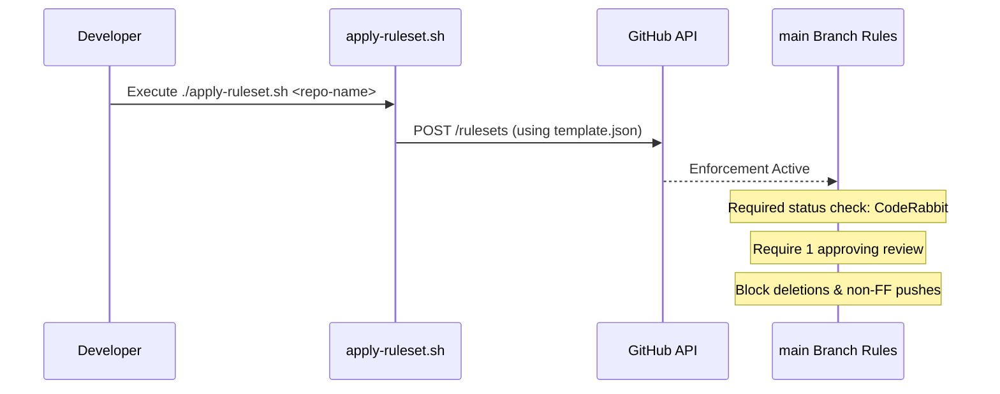

<details>
<summary>Relevant source files</summary>

The following files were used as context for generating this wiki page:

- [README.md](../../../README.md)
- [CLAUDE.md](../../../CLAUDE.md)
- [AGENTS.md](../../../AGENTS.md)
- [SECURITY.md](../../../SECURITY.md)
- [branch-ruleset-template.json](../../../branch-ruleset-template.json)
- [apply-ruleset.sh](../../../apply-ruleset.sh)
</details>

# Repository File Structure

## Introduction
The `repo-standard` repository serves as a "Gold Standard" template for all projects under the `blixten85` GitHub organization. Its primary purpose is to provide a unified structure, containing essential configuration files, GitHub Actions workflows, and security policies that should be present in every new repository to ensure consistency and automation.

The structure is designed to facilitate quick project bootstrapping by providing pre-configured tools for AI agent interaction, automated dependency management, and robust branch protection. Developers are expected to copy these standardized files into new repositories rather than building them from scratch.

Sources: [README.md:1-6](../../../README.md#L1-L6)

## Core Configuration and Documentation
The root directory contains critical documentation and configuration files that define the project's identity, security posture, and AI interaction guidelines.

### Project Standards
| File | Description |
|---|---|
| `LICENSE` | MIT License. |
| `SECURITY.md` | Defines vulnerability reporting procedures and security scopes. |
| `AGENTS.md` | Instructions and permissions for AI agents. |
| `CLAUDE.md` | Specific guidelines for the Claude AI assistant. |
| `.coderabbit.yaml` | Configuration for CodeRabbit automated PR reviews. |

Sources: [README.md:8-13](../../../README.md#L8-L13), [SECURITY.md:1-5](../../../SECURITY.md#L1-L5), [AGENTS.md:1-5](../../../AGENTS.md#L1-L5)

### AI Agent Guidelines
The repository explicitly defines boundaries for AI agents to prevent unauthorized administrative changes while allowing development tasks.

```mermaid
flowchart TD
    Agent[AI Agent] -->|Allowed| Develop[Modify Code / Create Branches]
    Agent -->|Allowed| Test[Run Tests / Open PRs]
    Agent -.- x|Forbidden| Admin[Push to Main / Merge PRs]
    Agent -.- x|Forbidden| Security[Modify Secrets / Org Settings]
    Agent -.- x|Forbidden| Workflow[Delete Branches / Disable Workflows]
```

The diagram illustrates the operational boundary for AI agents as defined in the repository standards.
Sources: [AGENTS.md:10-25](../../../AGENTS.md#L10-L25)

## GitHub Automation and Workflows
A significant portion of the repository structure is dedicated to `.github/` configurations that automate maintenance and quality assurance.

### Standard Workflows
The repository includes ten standard workflows located in `.github/workflows/` to handle core automation:
*  **Automation:** `auto-commit`, `auto-label`, `auto-merge`, `auto-rebase`, `auto-release`.
*  **Quality & Security:** `ci-autofix`, `codeql` (for static analysis), and `security-alerts-sync`.
*  **AI Integration:** `coderabbit-rewake` (to handle rate limits) and `claude-assign-trigger`.

Sources: [README.md:17-26](../../../README.md#L17-L26)

### Dependency Management
Dependabot is configured via `.github/dependabot.yml`. To avoid hitting CodeRabbit's rate limit (5 reviews/hour organization-wide), every repository must have a unique `schedule` window.

| Key | Value / Requirement |
|---|---|
| Schedule Days | Consolidated to Wednesday and Saturday nights. |
| Update Grouping | Patch/minor updates grouped into a single PR. |
| Configuration | Must update `schedule` and `lockFileMaintenance.schedule`. |

Sources: [README.md:14](../../../README.md#L14), [README.md:30-41](../../../README.md#L30-L41)

## Branch Protection and Security
The repository provides a template and script to enforce strict branch protection on the `main` branch.

### Ruleset Implementation
The `branch-ruleset-template.json` defines the technical requirements for merging code, while `apply-ruleset.sh` automates the application of these rules via the GitHub API.



The sequence shows the process of applying standardized branch protection.
Sources: [branch-ruleset-template.json:1-45](../../../branch-ruleset-template.json#L1-L45), [apply-ruleset.sh:1-12](../../../apply-ruleset.sh#L1-L12)

### Security Scope
The `SECURITY.md` file defines the scope for security audits, covering SSH transport (`Sources/SSHCore`), application code (`App/`, `LinuxApp/`), and repository configurations. It emphasizes that secrets must never be committed and that OAuth implementations must be PKCE-based.

Sources: [SECURITY.md:21-27](../../../SECURITY.md#L21-L27), [SECURITY.md:32-35](../../../SECURITY.md#L32-L35)

## Summary
The `repo-standard` repository provides a highly structured foundation for software projects. By centralizing GitHub Actions, branch protection rules, and AI interaction protocols, it ensures that all repositories in the organization maintain high standards for security, automation, and maintainability. Its file structure is optimized for both human developers and AI agents, with clear boundaries and automated feedback loops.
