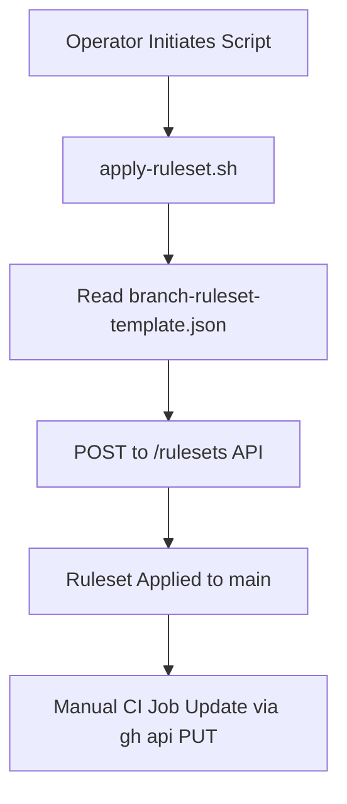
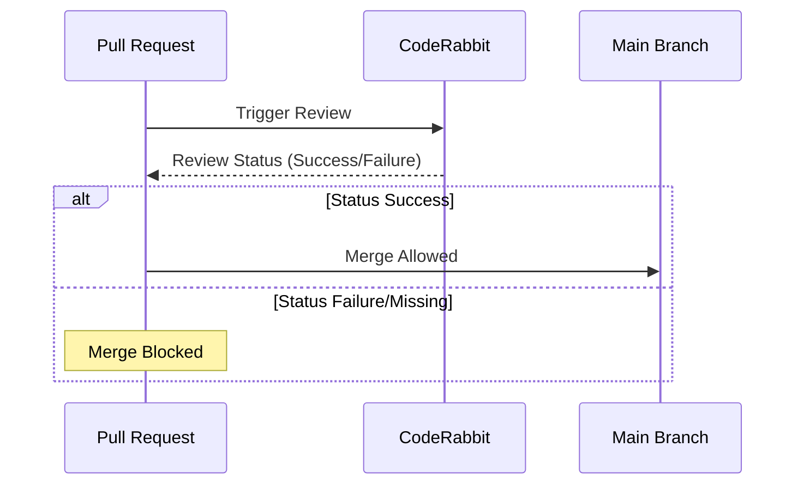

Relevant source files

The following files were used as context for generating this wiki page:

- [branch-ruleset-template.json](branch-ruleset-template.json)
- [README.md](README.md)
- [AGENTS.md](AGENTS.md)
- [SECURITY.md](SECURITY.md)
- [CLAUDE.md](CLAUDE.md)
- [apply-ruleset.sh](apply-ruleset.sh)

# Branch Protection Ruleset

The Branch Protection Ruleset is a core component of the `repo-standard` framework, designed to enforce a "gold standard" of repository management across the `blixten85` organization. Its primary purpose is to safeguard the `main` branch by mandating specific code review processes, preventing destructive actions, and ensuring automated status checks pass before integration.

This system establishes a standardized workflow where AI agents are granted specific operational permissions while being strictly prohibited from modifying branch protection settings or merging code directly. Manual intervention by an operator is required for ruleset application and modification to maintain human oversight over critical security and governance configurations.

Sources: [README.md:1-6](README.md#L1-L6), [README.md:21-23](README.md#L21-L23), [AGENTS.md:10-23](AGENTS.md#L10-L23), [apply-ruleset.sh:2-5](apply-ruleset.sh#L2-L5)

## Core Configuration and Enforcement

The ruleset is defined in a JSON template and targets the primary development branch. It is configured for active enforcement, meaning the rules are strictly applied to all contributors.

### Targeted Parameters

| Field | Value | Description |
|---|---|---|
| `name` | Protect main | The identifier for the ruleset. |
| `target` | branch | Specifies that the rules apply to branch patterns. |
| `enforcement` | active | The ruleset is live and blocking non-compliant actions. |
| `include` | `refs/heads/main` | The specific branch targeted by the protection rules. |

Sources: [branch-ruleset-template.json:2-15](branch-ruleset-template.json#L2-L15)

### Ruleset Deployment Flow

The deployment process is a manual operation performed via a shell script using the GitHub CLI (`gh`). This process is intentionally restricted from AI agents to prevent unauthorized changes to security postures.

*This diagram illustrates the manual path required to apply protection rules to a new repository.*

Sources: [apply-ruleset.sh:7-13](apply-ruleset.sh#L7-L13), [README.md:73-83](README.md#L73-L83)

## Pull Request and Review Requirements

The ruleset mandates a structured Pull Request (PR) workflow to ensure code quality and stability. This includes mandatory reviews and specific merge method constraints.

### Review Policies
*  **Approval Count:** At least one approving review is required before a PR can be merged.
*  **Stale Reviews:** Approvals are dismissed when new commits are pushed to the PR branch.
*  **Thread Resolution:** All review comments and threads must be resolved.
*  **Merge Methods:** Only `squash` and `rebase` methods are permitted; standard merges are disabled to maintain a clean history.

Sources: [branch-ruleset-template.json:18-32](branch-ruleset-template.json#L18-L32)

### Required Status Checks
A critical component of the protection ruleset is the integration of automated checks. By default, **CodeRabbit** is a required status check. Because it is required, if a review fails to trigger or finishes in a blocked state, the PR is permanently blocked until manually re-triggered.

*Sequence showing how CodeRabbit acts as a gatekeeper for the main branch.*

Sources: [branch-ruleset-template.json:42-53](branch-ruleset-template.json#L42-L53), [README.md:34-40](README.md#L34-L40)

## AI Agent Restrictions and Permissions

The project defines clear boundaries for AI agents (such as Claude) through `AGENTS.md` and `CLAUDE.md`. These boundaries complement the technical branch protections by defining what is socially and operationally "Allowed" vs "Forbidden."

### Permission Matrix

| Allowed Actions | Forbidden Actions |
|---|---|
| Create branches | Push directly to main/master |
| Modify code | Merge Pull Requests |
| Run tests | Delete branches |
| Open PRs | Disable workflows or modify secrets |

Sources: [AGENTS.md:10-23](AGENTS.md#L10-L23)

These restrictions are reflected in the `apply-ruleset.sh` script, which notes that branch-protection changes via API are blocked for agents in the organization under the "CI Bypass" category.

Sources: [apply-ruleset.sh:2-5](apply-ruleset.sh#L2-L5), [AGENTS.md:21](AGENTS.md#L21)

## Automation and Scheduling

To prevent rate-limiting issues with required status checks (specifically CodeRabbit), the project enforces a strict scheduling protocol for Dependabot updates across the organization.

### Dependabot Schedule Management
Each repository must be assigned a unique 30-minute window for updates to avoid exceeding the CodeRabbit limit of 5 reviews per hour across the entire organization.

| Example Repo | Window | Day |
|---|---|---|
| repo-standard | 02:00–02:30 | Wednesday |
| scraper | 23:00–23:30 | Wednesday |
| politiker-webapp | 01:00–01:30 | Saturday |

Sources: [README.md:42-68](README.md#L42-L68)

## Conclusion

The Branch Protection Ruleset in `repo-standard` provides a robust framework for maintaining repository integrity. By combining JSON-based rule templates (`branch-ruleset-template.json`), manual deployment scripts (`apply-ruleset.sh`), and strict AI agent guidelines (`AGENTS.md`), the system ensures that the `main` branch remains stable, secure, and under human control while leveraging AI for development tasks.

Sources: [README.md:73-86](README.md#L73-L86), [apply-ruleset.sh:11-13](apply-ruleset.sh#L11-L13)
