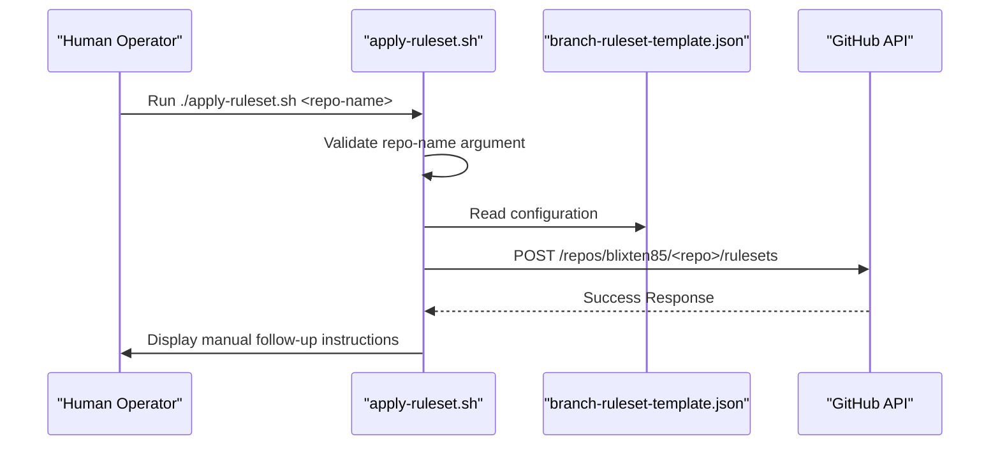
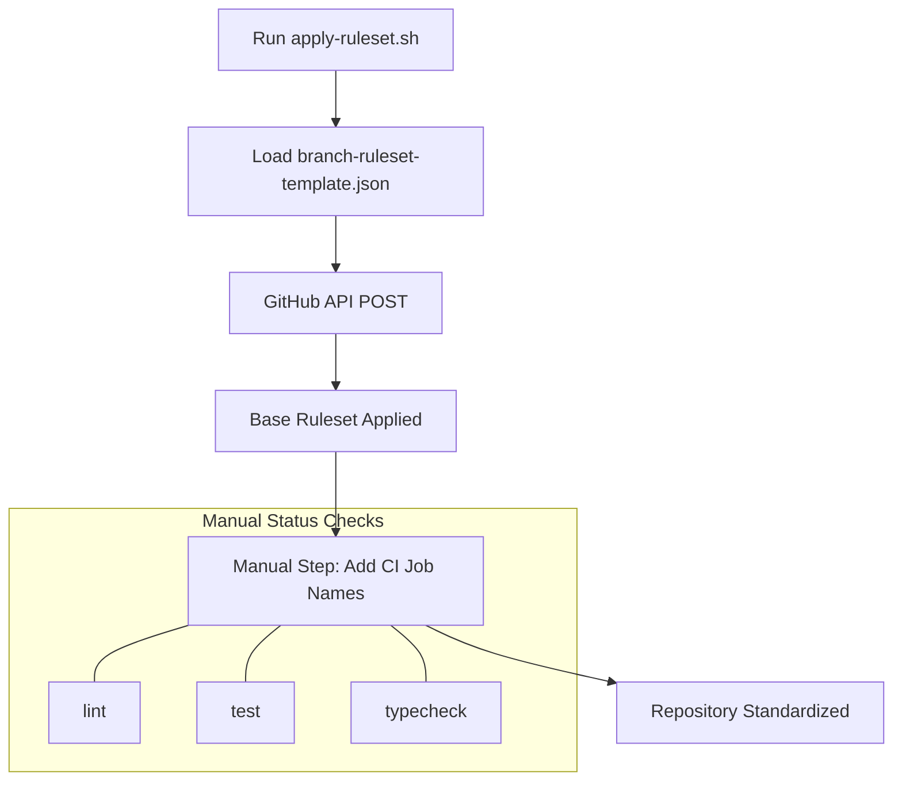

Relevant source files

The following files were used as context for generating this wiki page:

- [apply-ruleset.sh](apply-ruleset.sh)
- [branch-ruleset-template.json](branch-ruleset-template.json)
- [README.md](README.md)
- [AGENTS.md](AGENTS.md)
- [SECURITY.md](SECURITY.md)

# Applying Rulesets via CLI

The "Applying Rulesets via CLI" feature provides a standardized method for enforcing branch protection on the `main` branch of repositories within the `blixten85` organization. This system utilizes a shell script and a JSON template to programmatically apply complex security and workflow rules via the GitHub REST API.

The primary purpose of this system is to ensure that all new and existing repositories adhere to the "Gold Standard" configuration. This includes mandatory pull request reviews, status checks (specifically CodeRabbit), and restrictions on destructive actions like force-pushing or branch deletion. For security reasons, modifications to branch rulesets are restricted to human operators and are explicitly forbidden for AI agents.
Sources: [README.md:1-5](README.md#L1-L5), [apply-ruleset.sh:1-6](apply-ruleset.sh#L1-L6), [AGENTS.md:16-23](AGENTS.md#L16-L23)

## Execution Logic and Architecture

The process of applying rulesets is centered around a bash script that interacts with the GitHub CLI (`gh`). It takes a repository name as an argument and pushes a predefined JSON configuration to the GitHub API endpoint for rulesets.

### Workflow Sequence
The following diagram illustrates the sequence of actions taken when a user executes the ruleset application script.

The script uses `set -euo pipefail` to ensure robust error handling during execution. It specifically targets the `blixten85` organization namespace.
Sources: [apply-ruleset.sh:8-12](apply-ruleset.sh#L8-L12)

## Ruleset Configuration Details

The ruleset applied via the CLI is defined in `branch-ruleset-template.json`. It targets the `refs/heads/main` branch specifically and is set to an "active" enforcement state.

### Core Rules Components
The ruleset includes several protective layers:
*  **Pull Request Requirements**: Enforces at least one approving review and mandates the resolution of all review threads before merging.
*  **Merge Restrictions**: Limits allowed merge methods to "squash" and "rebase" to maintain a clean history.
*  **Status Checks**: Requires specific integrations to pass. By default, it mandates the "CodeRabbit" status check (Integration ID: 347564).
*  **Integrity Protections**: Disables non-fast-forward pushes and branch deletion.

| Rule Type | Parameter | Value |
| :--- | :--- | :--- |
| `pull_request` | `required_approving_review_count` | 1 |
| `pull_request` | `dismiss_stale_reviews_on_push` | true |
| `pull_request` | `required_review_thread_resolution` | true |
| `required_status_checks` | `strict_required_status_checks_policy` | true |
| `required_status_checks` | `context` | CodeRabbit |

Sources: [branch-ruleset-template.json:1-49](branch-ruleset-template.json#L1-L49)

## Operational Constraints and Security

A critical aspect of the ruleset application is the "Human-in-the-loop" requirement. Branch protection changes are classified as high-privilege operations.

### Agent Restrictions
AI agents operating within the repository (configured via `AGENTS.md`) have explicit boundaries. While they can create branches and open PRs, they are strictly forbidden from modifying GitHub organization settings or merging PRs. The `apply-ruleset.sh` script is categorized as a "CI Bypass" category tool that must not be run by agents.
Sources: [apply-ruleset.sh:2-4](apply-ruleset.sh#L2-L4), [AGENTS.md:16-23](AGENTS.md#L16-L23)

### Manual Post-Processing
Because every repository may have different CI requirements (e.g., specific linting or testing jobs), the CLI script only applies the base ruleset. Users must manually add repository-specific status checks using the GitHub API or UI.

Sources: [apply-ruleset.sh:13-15](apply-ruleset.sh#L13-L15), [README.md:121-124](README.md#L121-L124)

## Summary of Relevant Files
| File | Role |
| :--- | :--- |
| `apply-ruleset.sh` | CLI entry point for applying the standard ruleset. |
| `branch-ruleset-template.json` | The data model for branch protection settings. |
| `README.md` | Provides the context for the "Gold Standard" and manual upgrade paths. |
| `AGENTS.md` | Defines the security boundaries preventing automated modification of rulesets. |
| `SECURITY.md` | Outlines the broader security policy including repo-configuration scope. |

Sources: [apply-ruleset.sh](apply-ruleset.sh), [branch-ruleset-template.json](branch-ruleset-template.json), [README.md](README.md), [AGENTS.md](AGENTS.md), [SECURITY.md:23-28](SECURITY.md#L23-L28)
