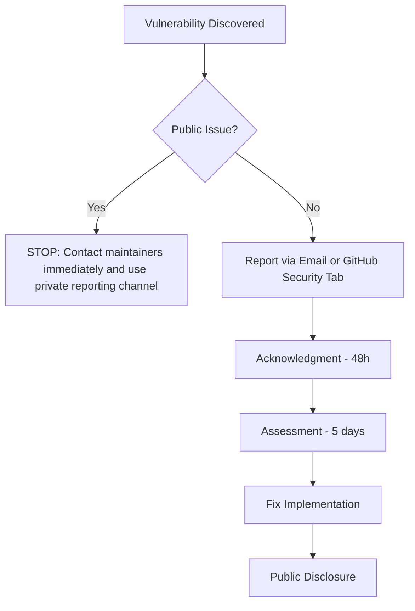
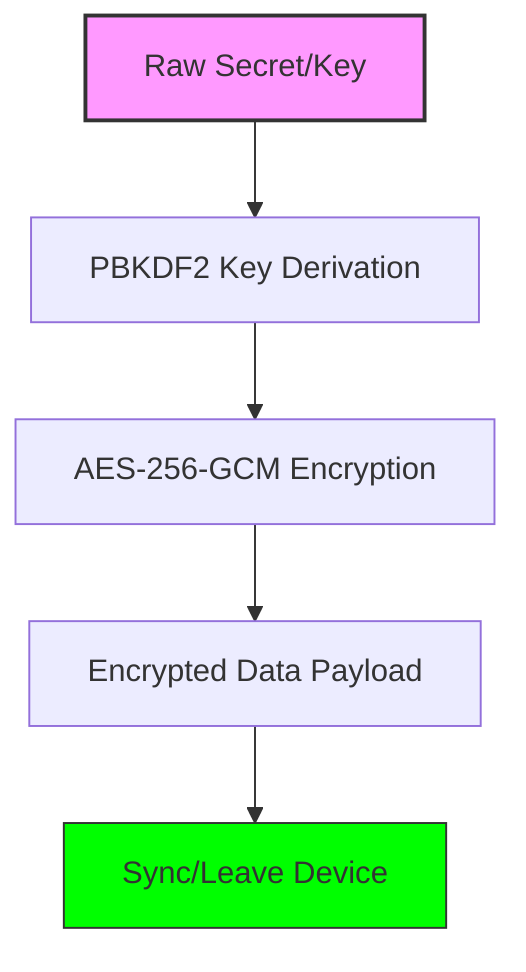

Relevant source files

The following files were used as context for generating this wiki page:

- [SECURITY.md](../../../SECURITY.md)
- [README.md](../../../README.md)
- [AGENTS.md](../../../AGENTS.md)
- [branch-ruleset-template.json](../../../branch-ruleset-template.json)
- [apply-ruleset.sh](../../../apply-ruleset.sh)

# Standard Security Policy

## Introduction

The Standard Security Policy for the `repo-standard` project establishes a unified framework for vulnerability reporting, data protection, and repository governance across all `blixten85` organizations. It defines the protocols for handling sensitive information such as SSH keys and OAuth tokens, ensuring they remain encrypted and localized to the user's device.

This policy serves as the "gold standard" template, providing standardized GitHub Actions workflows, branch protection rules, and AI agent guidelines to maintain high security integrity. It covers core components including `Sources/SSHCore`, application interfaces (`App/` and `LinuxApp/`), and automated repository configurations.
Sources: [SECURITY.md:1-2](../../../SECURITY.md#L1-L2), [README.md:1-5](../../../README.md#L1-L5), [SECURITY.md:27-32](../../../SECURITY.md#L27-L32)

## Vulnerability Management

The project mandates private reporting of security vulnerabilities to prevent public exposure before a fix is available. Reporters are directed to use either a dedicated email or the GitHub "Report a vulnerability" feature.

### Response Pipeline
The following table outlines the timeline for addressing reported vulnerabilities:

| Stage | Timeframe |
| :--- | :--- |
| Initial acknowledgment | Within 48 hours |
| Assessment | Within 5 business days |
| Fix implementation | Based on severity |
| Public disclosure | After fix is released |

Sources: [SECURITY.md:3-23](../../../SECURITY.md#L3-L23)

### Vulnerability Reporting Flow
This diagram illustrates the process from discovery to public disclosure:

Sources: [SECURITY.md:5-23](../../../SECURITY.md#L5-L23)

## Data Protection and Encryption

Sensitive credentials, including SSH keys and OAuth tokens, are subject to strict architectural constraints to prevent accidental exposure.

### Key Security Principles
1.  **Local Storage:** Credentials are stored in the system Keychain (iOS/macOS) and never in cleartext on disk.
2.  **Encryption at Rest/Transit:** Keys are encrypted using **AES-256-GCM** and **PBKDF2** before leaving the device for synchronization.
3.  **Zero-Secret Commits:** Contributors are strictly forbidden from committing secrets, client secrets, or tokens to the repository.
4.  **PKCE-based OAuth:** The application utilizes Proof Key for Code Exchange (PKCE), meaning the client does not carry a hardcoded secret; only a public client ID is stored in `App/OAuthProviders.swift`.

Sources: [SECURITY.md:43-60](../../../SECURITY.md#L43-L60), [AGENTS.md:9-10](../../../AGENTS.md#L9-L10)

### Sync Encryption Logic
The following diagram represents the data flow for sensitive keys during synchronization:

Sources: [SECURITY.md:49-50](../../../SECURITY.md#L49-L50), [SECURITY.md:65-67](../../../SECURITY.md#L65-L67)

## Repository Governance and Automation

The security of the codebase is maintained through automated workflows and rigid branch protection rules applied via a standard template.

### Branch Protection (Protect main)
The `branch-ruleset-template.json` enforces high standards for the `main` branch, preventing direct pushes and ensuring code quality through required checks.

| Rule Type | Configuration |
| :--- | :--- |
| Pull Request | 1 required approving review |
| Review Dismissal | Dismiss stale reviews on push |
| Thread Resolution | Required before merge |
| Merge Methods | Squash or Rebase only |
| Status Checks | CodeRabbit required (ID: 347564) |
| Restrictions | No Deletions, No Non-Fast-Forward pushes |

Sources: [branch-ruleset-template.json:10-53](../../../branch-ruleset-template.json#L10-L53)

### AI Agent Security (AGENTS.md)
Guidelines for AI agents (like Claude) restrict operations that could compromise repository integrity or security settings.

*  **Allowed Actions:** Creating branches, modifying code, running tests, and opening PRs.
*  **Forbidden Actions:** Pushing to `main`, merging PRs, modifying secrets, and changing GitHub organization settings.
*  **Manual Override:** The `apply-ruleset.sh` script is explicitly marked to be run by human operators only, as branch protection changes via API are blocked for agents.

Sources: [AGENTS.md:12-23](../../../AGENTS.md#L12-L23), [apply-ruleset.sh:2-4](../../../apply-ruleset.sh#L2-L4)

## Security Maintenance
The project uses automated tools to ensure dependencies and workflows remain secure:
*  **Dependabot:** Automatically updates dependencies to mitigate vulnerabilities in third-party libraries.
*  **CodeQL:** Performs static analysis to detect injection-sensitive areas in public repositories.
*  **Security Alerts Sync:** A standard workflow (`security-alerts-sync.yml`) ensures synchronization of security alerts.

Sources: [SECURITY.md:52](../../../SECURITY.md#L52), [README.md:15](../../../README.md#L15), [README.md:32-34](../../../README.md#L32-L34)

## Summary
The Standard Security Policy ensures that the `repo-standard` and its derivatives maintain a robust security posture by combining strong encryption standards (AES-256-GCM), strict branch protections, and clear protocols for vulnerability management. By centralizing these configurations, the project minimizes the risk of credential exposure and ensures consistent enforcement of security best practices across the organization.
