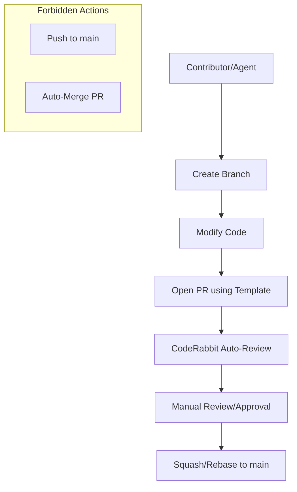

<details>
<summary>Relevant source files</summary>

The following files were used as context for generating this wiki page:

- [.github/pull_request_template.md](.github/pull_request_template.md)
- [README.md](README.md)
- [SECURITY.md](SECURITY.md)
- [AGENTS.md](AGENTS.md)
- [branch-ruleset-template.json](branch-ruleset-template.json)
- [apply-ruleset.sh](apply-ruleset.sh)
</details>

# Pull Request and Issue Templates

The `repo-standard` project serves as a "gold standard" template repository for the `blixten85` organization. It defines a standardized structure for handling code contributions and issue reporting through specialized Markdown templates located in the `.github/` directory. These templates ensure consistency across all organization repositories, facilitating automated reviews and maintaining high code quality.

The templates are integrated with a broader automation ecosystem, including CodeRabbit for automated PR reviews and specific branch protection rules applied to the `main` branch. This structure is designed to be copied into new repositories to provide an immediate, standardized development environment.

Sources: [README.md:1-8](README.md#L1-L8), [README.md:12-21](README.md#L12-L21)

## Pull Request Infrastructure

The repository utilizes a standardized Pull Request (PR) template to guide contributors through the submission process. This template is designed to work in tandem with automated status checks and branch protection rules.

### PR Submission Flow

When a PR is opened, it must adhere to specific organizational constraints. AI agents are permitted to open PRs and modify code but are strictly forbidden from merging them or pushing directly to `main`. Furthermore, all PRs are subject to automated reviews by CodeRabbit, which is a required status check.



The diagram shows the standard flow from branch creation to merge, highlighting that agents can open PRs but cannot bypass manual reviews or branch protection.
Sources: [AGENTS.md:10-23](AGENTS.md#L10-L23), [branch-ruleset-template.json:18-35](branch-ruleset-template.json#L18-L35), [README.md:16](README.md#L16)

### Branch Protection and Merge Rules

PRs are governed by a branch ruleset defined in `branch-ruleset-template.json`. This configuration enforces specific criteria before a PR can be merged into the `main` branch:

| Rule Type | Requirement |
| :--- | :--- |
| **Approvals** | At least 1 approving review required |
| **Thread Resolution** | All review threads must be resolved |
| **Status Checks** | CodeRabbit check must pass |
| **Merge Methods** | Only `squash` and `rebase` are allowed |
| **Stability** | Stale reviews are dismissed on new pushes |

Sources: [branch-ruleset-template.json:18-50](branch-ruleset-template.json#L18-L50), [README.md:21](README.md#L21)

## Issue and Vulnerability Management

The project distinguishes between standard issues (tracked via templates in `.github/ISSUE_TEMPLATE/`) and security vulnerabilities, which have a dedicated reporting pipeline.

### Security Reporting Protocol

Vulnerabilities must not be reported via public issues. Instead, the project provides a private reporting mechanism through `SECURITY.md`.

```mermaid
flowchart TD
    Vulnerability[Found Vulnerability] --> Public{Public Issue?}
    Public -- Yes --> Forbidden[DO NOT DO THIS]
    Public -- No --> Private[Report Privately]
    Private --> Email[dev@denied.se]
    Private --> GH_Security[GitHub Security Tab]
    GH_Security --> Assess[Assessment within 5 days]
    Assess --> Fix[Fix Implementation]
```

The diagram outlines the private disclosure path for security-related findings.
Sources: [SECURITY.md:5-18](SECURITY.md#L5-L18)

### Security Scope and Exclusions

The templates and security policy apply to specific components within the organization's standard architecture.

| Component | In Scope | Out of Scope |
| :--- | :--- | :--- |
| **Core Logic** | SSHCore (Transport, Auth, Sync) | Third-party dependencies (SwiftNIO, etc.) |
| **Applications** | iOS/macOS App, Linux GUI | External API/OAuth services (Google, Dropbox) |
| **Infrastructure** | GitHub Actions, Repo Config | - |

Sources: [SECURITY.md:28-40](SECURITY.md#L28-L40)

## Implementation and Automation

The application of these templates and rules is partially automated but requires manual triggers for sensitive configurations.

### Ruleset Deployment

The script `apply-ruleset.sh` is used to apply the branch protection ruleset to new repositories. This action is restricted from AI agents to prevent unauthorized changes to organizational settings.

```bash
#!/bin/bash
# Usage: ./apply-ruleset.sh <repo-namn>
set -euo pipefail
REPO="${1:?Usage: ./apply-ruleset.sh <repo-namn>}"
gh api --method POST "repos/blixten85/$REPO/rulesets" --input "$(dirname "$0")/branch-ruleset-template.json"
```

Sources: [apply-ruleset.sh:1-12](apply-ruleset.sh#L1-L12), [README.md:73-76](README.md#L73-L76)

### Agent Guidelines

Repositories include `AGENTS.md` and `CLAUDE.md`, which provide instructions for AI agents regarding the use of templates and code conventions. These files require manual configuration of placeholders like `<repo-name>` before use.

**Core Agent Requirements:**
- All tests must pass before PR submission.
- PRs must remain focused and exclude unrelated changes.
- Credentials and secrets must never be committed.
- Force pushing is strictly prohibited.

Sources: [AGENTS.md:1-29](AGENTS.md#L1-L29), [CLAUDE.md:1-8](CLAUDE.md#L1-L8), [README.md:14](README.md#L14)

## Summary

The Pull Request and Issue Templates in `repo-standard` provide a structured framework for contribution and maintenance. By combining Markdown templates with JSON rulesets and automated review tools like CodeRabbit, the project ensures that all repositories in the `blixten85` organization maintain a consistent security posture and code quality standard. This system enforces manual oversight for critical branch changes while allowing for efficient, agent-assisted development workflows.
