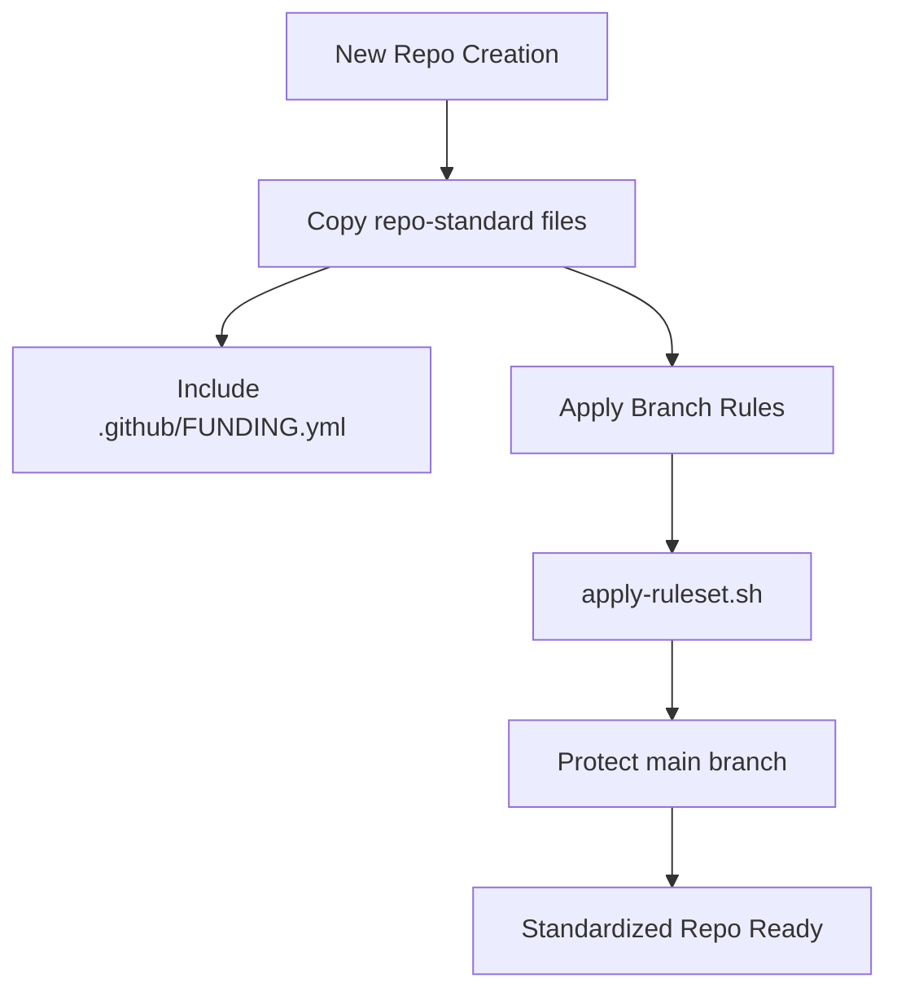
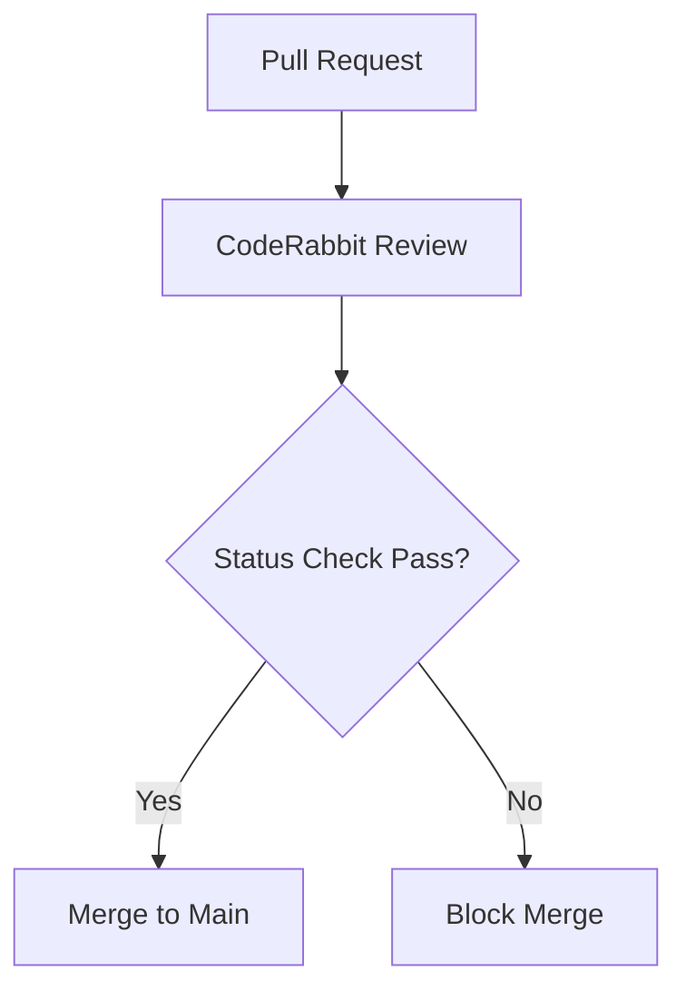

Relevant source files

The following files were used as context for generating this wiki page:

- [.github/FUNDING.yml](../../../.github/FUNDING.yml)
- [README.md](../../../README.md)
- [SECURITY.md](../../../SECURITY.md)
- [AGENTS.md](../../../AGENTS.md)
- [branch-ruleset-template.json](../../../branch-ruleset-template.json)
- [apply-ruleset.sh](../../../apply-ruleset.sh)

# Funding Configuration

The Funding Configuration is a standardized component of the `repo-standard` repository, designed to provide a consistent mechanism for displaying sponsorship links across all `blixten85` projects. It serves as a "gold standard" template that ensures every new repository includes the necessary metadata to facilitate financial support for the maintainers.

This configuration is primarily managed through GitHub-native files located in the `.github` directory. It integrates with the broader repository standards, which include security policies, AI agent guidelines, and automated branch protection rules to maintain project integrity while seeking community support.
Sources: [README.md:1-12](../../../README.md#L1-L12), [.github/FUNDING.yml](../../../.github/FUNDING.yml)

## Architecture and Components

The funding system is decentralized but standardized. Each repository inherits a baseline configuration that can be customized during the initial setup of a new project.

### Core Configuration Files

The primary mechanism for funding is the `FUNDING.yml` file. In the `repo-standard` architecture, this file is categorized alongside other metadata automations like the labeler.

| Component | File Path | Purpose |
| :--- | :--- | :--- |
| Funding Metadata | `.github/FUNDING.yml` | Defines the sponsorship platforms and usernames. |
| Standardization Docs | `README.md` | Provides instructions for copying the funding template to new repos. |
| Security Context | `SECURITY.md` | Outlines the scope of protection for repository configuration files. |

Sources: [README.md:9-12](../../../README.md#L9-L12), [SECURITY.md:33-37](../../../SECURITY.md#L33-L37)

### Integration with Repository Setup

When a new repository is created, the funding configuration is deployed as part of the "Quick Start" process. This involves copying the template files from `repo-standard` to the target repository.

The diagram shows the workflow for initializing a repository with the standard configuration, including funding and protection rules.
Sources: [README.md:92-108](../../../README.md#L92-L108), [apply-ruleset.sh:9-13](../../../apply-ruleset.sh#L9-L13)

## Security and Governance

The configuration of funding links and repository metadata is governed by strict security policies and agent restrictions to prevent unauthorized modifications.

### Agent Restrictions
AI agents and automated tools have specific boundaries regarding repository settings. While they are allowed to modify code and open Pull Requests, they are explicitly forbidden from changing GitHub organization settings. This ensures that the financial and structural integrity of the project remains under human control.

| Action | Agent Permission | Source Reference |
| :--- | :--- | :--- |
| Modify Code | Allowed | [AGENTS.md:10](../../../AGENTS.md#L10) |
| Open PRs | Allowed | [AGENTS.md:12](../../../AGENTS.md#L12) |
| Change Org Settings | **Forbidden** | [AGENTS.md:19](../../../AGENTS.md#L19) |
| Modify Secrets | **Forbidden** | [AGENTS.md:18](../../../AGENTS.md#L18) |

Sources: [AGENTS.md:9-20](../../../AGENTS.md#L9-L20)

### Branch Protection Rules
Funding configurations and other `.github` metadata are protected by the "Protect main" ruleset. This ruleset requires pull requests and status checks (such as CodeRabbit) before changes can be merged into the `main` branch.

This flow illustrates how modifications to configuration files are gated by automated reviews.
Sources: [branch-ruleset-template.json:16-52](../../../branch-ruleset-template.json#L16-L52), [README.md:20-22](../../../README.md#L20-L22)

## Implementation Details

The funding configuration is intended to be static once deployed but resides within the scope of the project's security policy.

### Scope of Security Policy
The `SECURITY.md` file explicitly includes "GitHub Actions-workflows and repo-konfigurationen" (repo configuration) within its scope. This means any vulnerability or unauthorized change in the funding setup should be reported through the private security channels provided.
Sources: [SECURITY.md:36-37](../../../SECURITY.md#L36-L37)

### Usage in New Repositories
To implement the funding configuration in a new project, developers follow the standard copy procedure:

1. Copy `.github/FUNDING.yml` along with other core files.
2. Ensure the file reflects the correct sponsorship links for the specific project.
3. Apply branch rules using `apply-ruleset.sh` to protect the configuration from unauthorized direct pushes.

Sources: [README.md:92-108](../../../README.md#L92-L108), [apply-ruleset.sh:9-13](../../../apply-ruleset.sh#L9-L13)

## Summary
The Funding Configuration within the `repo-standard` project provides a unified approach to project sponsorship. By utilizing `.github/FUNDING.yml` as a template and enforcing strict governance through AI agent guidelines and branch protection rules, the `blixten85` organization ensures that all repositories are consistently prepared for community support while maintaining high security standards for repository metadata.
