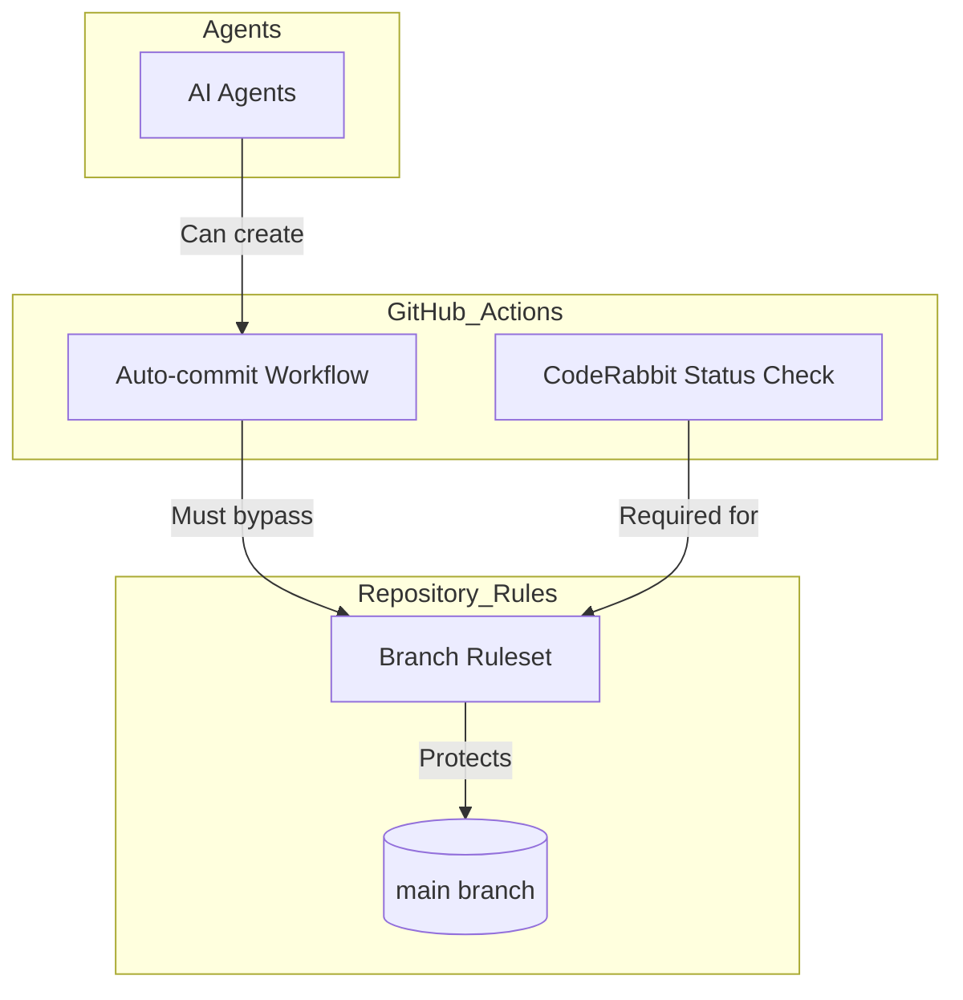
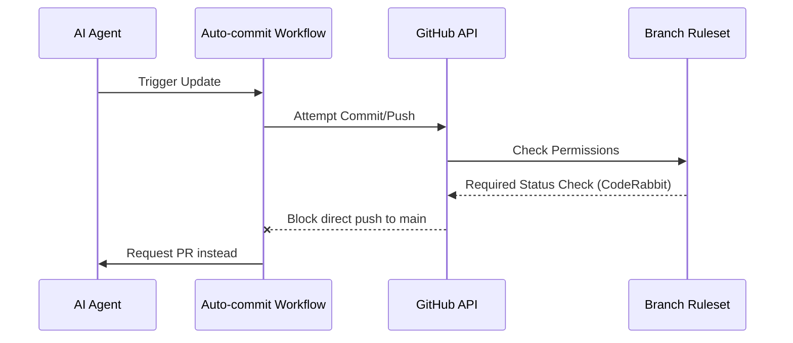

<details>
<summary>Relevant source files</summary>

The following files were used as context for generating this wiki page:

- [.github/workflows/auto-commit.yml](.github/workflows/auto-commit.yml)
- [README.md](README.md)
- [AGENTS.md](AGENTS.md)
- [branch-ruleset-template.json](branch-ruleset-template.json)
- [apply-ruleset.sh](apply-ruleset.sh)
- [SECURITY.md](SECURITY.md)
</details>

# Auto-commit Workflow

The Auto-commit Workflow is a core component of the repository's automation suite designed to handle automated updates and maintenance tasks within the `blixten85` organization's standard repository structure. It serves as part of a "gold standard" template used to ensure consistency across all projects, automating repetitive Git operations while adhering to strict security and branch protection guidelines.

This workflow operates alongside other automation tools such as `auto-label.yml`, `auto-merge.yml`, and `ci-autofix.yml` to maintain repository health. Its primary scope includes managing automated commits that do not violate organization-level restrictions, such as the prohibition against AI agents modifying branch protections or pushing directly to the main branch.

Sources: [README.md:3-8](README.md#L3-L8), [README.md:19-21](README.md#L19-L21), [AGENTS.md:14-25](AGENTS.md#L14-L25)

## Architecture and Integration

The workflow is integrated into the GitHub Actions environment and is subject to the repository's branch protection rules. These rules are enforced via a standardized ruleset that requires pull requests and status checks for changes to the `main` branch.

### Component Relationship
The following diagram illustrates how the Auto-commit Workflow interacts with branch protections and AI agent permissions.



The diagram shows that while AI agents can trigger automation, all resulting commits must pass through the branch ruleset, which includes mandatory CodeRabbit reviews.
Sources: [README.md:25-28](README.md#L25-L28), [branch-ruleset-template.json:1-45](branch-ruleset-template.json#L1-L45)

### Automation Ecosystem
The Auto-commit Workflow is one of several standard workflows provided in the `.github/workflows/` directory.

| Workflow Name | Purpose |
|---|---|
| `auto-commit.yml` | Handles automated Git commits for maintenance. |
| `auto-label.yml` | Automatically categorizes issues and PRs. |
| `auto-merge.yml` | Merges qualified PRs based on status checks. |
| `ci-autofix.yml` | Automatically fixes linting or formatting issues. |
| `security-alerts-sync.yml` | Synchronizes security vulnerability data. |

Sources: [README.md:19-22](README.md#L19-L22)

## Security and Permission Boundaries

The execution of automated commits is strictly governed by the organization's security policy and agent guidelines. AI agents and automated workflows are granted specific permissions but are explicitly blocked from high-risk operations.

### Agent Permissions Matrix
| Action | Permission |
|---|---|
| Create Branches | Allowed |
| Modify Code | Allowed |
| Open PRs | Allowed |
| Push to Main | Forbidden |
| Modify Secrets | Forbidden |
| Change Org Settings | Forbidden |

Sources: [AGENTS.md:10-25](AGENTS.md#L10-L25)

### Branch Protection Logic
The workflow must respect the `Protect main` ruleset. This ruleset is applied using the `apply-ruleset.sh` script, which specifically blocks agents from modifying branch protections via the API (CI Bypass category).



The workflow logic ensures that any automated changes are funneled through the Pull Request process, requiring at least one approving review and successful status checks from CodeRabbit.
Sources: [AGENTS.md:14-19](AGENTS.md#L14-L19), [branch-ruleset-template.json:10-40](branch-ruleset-template.json#L10-L40), [apply-ruleset.sh:1-10](apply-ruleset.sh#L1-L10)

## Implementation Details

The workflow is designed to be portable across the `blixten85` organization. When a new repository is created, the workflow is copied as part of the standard initialization process.

### Configuration and Deployment
1. **File Path:** `.github/workflows/auto-commit.yml`
2. **Prerequisites:** The repository must have the CodeRabbit GitHub App installed, as it is a required status check in the standard ruleset.
3. **Branch Target:** By default, the ruleset targets `refs/heads/main`.

Sources: [README.md:53-62](README.md#L53-L62), [branch-ruleset-template.json:6-10](branch-ruleset-template.json#L6-L10)

### Rule Enforcement Snippet
The following JSON structure from the template defines the environment in which the workflow operates, specifically requiring CodeRabbit integration (ID `347564`).

```json
{
  "type": "required_status_checks",
  "parameters": {
    "strict_required_status_checks_policy": true,
    "required_status_checks": [
      {
        "context": "CodeRabbit",
        "integration_id": 347564
      }
    ]
  }
}
```

Sources: [branch-ruleset-template.json:35-44](branch-ruleset-template.json#L35-L44)

## Summary
The Auto-commit Workflow provides a standardized mechanism for automated repository maintenance within the `repo-standard` framework. It is strictly constrained by branch protection rules that mandate PR reviews and external status checks, ensuring that automated commits do not bypass security protocols or project conventions.
