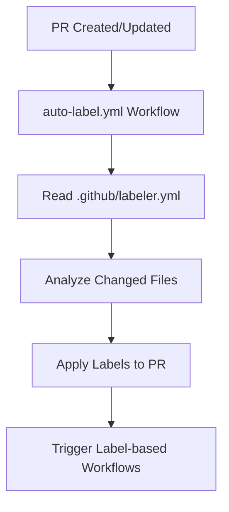
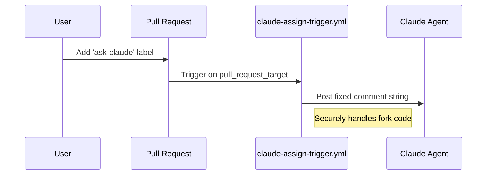

<details>
<summary>Relevant source files</summary>

The following files were used as context for generating this wiki page:

- [.github/workflows/auto-label.yml](.github/workflows/auto-label.yml)
- [.github/labeler.yml](.github/labeler.yml)
- [README.md](README.md)
- [branch-ruleset-template.json](branch-ruleset-template.json)
- [apply-ruleset.sh](apply-ruleset.sh)
- [.github/workflows/claude-assign-trigger.yml](.github/workflows/claude-assign-trigger.yml)
</details>

# Auto-labeling System

The Auto-labeling System in the `repo-standard` repository is a core automation component designed to categorize Pull Requests (PRs) and manage workflow triggers automatically. It ensures that every contribution is tagged based on modified file paths and specific label-based triggers, facilitating efficient review processes and automated agent interactions.

This system is part of a broader "gold standard" template used across the `blixten85` organization to maintain consistency in repository management, security, and AI agent integration.
Sources: [README.md:1-5](README.md#L1-L5), [README.md:21-25](README.md#L21-L25)

## System Architecture

The system operates primarily through GitHub Actions and configuration files that define how labels should be applied to Pull Requests. It consists of two main functional areas: automated file-based labeling and label-triggered workflow execution.

### Automation Workflow
The primary entry point for automatic labeling is a dedicated GitHub Action. This action monitors Pull Request activities and applies labels based on the configuration defined in the repository.



The diagram shows the sequence of events from a PR update to the application of labels and subsequent triggers.
Sources: [README.md:15](README.md#L15), [README.md:21-22](README.md#L21-L22), [.github/workflows/auto-label.yml](.github/workflows/auto-label.yml)

### Configuration Elements
The behavior of the labeling system is governed by specific configuration files and templates within the `.github` directory.

| Component | File Path | Description |
|-----------|-----------|-------------|
| Label Definitions | `.github/labeler.yml` | Maps file paths or patterns to specific GitHub labels. |
| Automation Job | `.github/workflows/auto-label.yml` | Executes the labeling logic on PR events. |
| Claude Trigger | `.github/workflows/claude-assign-trigger.yml` | A specific workflow that responds to the `ask-claude` label. |
| Rule Enforcement | `branch-ruleset-template.json` | Can mandate status checks like CodeRabbit which interact with the labeling flow. |

Sources: [README.md:11-25](README.md#L11-L25), [branch-ruleset-template.json:1-10](branch-ruleset-template.json#L1-L10)

## Label-Based Workflow Triggers

Labels in this system are not merely for organization; they act as triggers for advanced automation, specifically involving AI agents and security tools.

### Claude AI Integration
A specialized label, `ask-claude`, is used to invoke AI assistance. When this label is detected on a PR, a specific workflow is triggered to interact with Claude.



This sequence illustrates how the manual addition of a label initiates a secure automated response from an AI agent.
Sources: [README.md:31-34](README.md#L31-L34), [.github/workflows/claude-assign-trigger.yml](.github/workflows/claude-assign-trigger.yml)

### Integration with External Services
The system coordinates with third-party services like CodeRabbit and Dependabot. While Dependabot creates PRs, the auto-labeling system helps categorize these updates. CodeRabbit is configured as a required status check in the branch rulesets, ensuring that labeled PRs undergo automated review.
Sources: [README.md:37-43](README.md#L37-L43), [branch-ruleset-template.json:44-55](branch-ruleset-template.json#L44-L55)

## Implementation Details

### Branch Protection and Rulesets
The labeling system is supported by branch protection rules defined in `branch-ruleset-template.json`. These rules ensure that labels associated with required status checks (like CodeRabbit) are respected before a merge to `main` can occur.

```json
{
  "type": "required_status_checks",
  "parameters": {
    "strict_required_status_checks_policy": true,
    "required_status_checks": [
      {
        "context": "CodeRabbit",
        "integration_id": 347564
      }
    ]
  }
}
```

Sources: [branch-ruleset-template.json:44-55](branch-ruleset-template.json#L44-L55), [apply-ruleset.sh:15-18](apply-ruleset.sh#L15-L18)

### Setup and Deployment
To apply the labeling and protection standards to a new repository, the `apply-ruleset.sh` script is utilized. This script posts the ruleset configuration to the GitHub API for a target repository. It is explicitly noted that this script must be run by a human operator, as branch protection changes are blocked for AI agents.
Sources: [apply-ruleset.sh:1-12](apply-ruleset.sh#L1-L12), [README.md:95-98](README.md#L95-L98)

## Summary
The Auto-labeling System serves as the foundation for PR management in the `repo-standard` framework. By combining path-based labeling via `labeler.yml` with event-driven workflows like `claude-assign-trigger.yml`, the project automates categorization and provides a secure mechanism for AI agent interaction, all while maintaining strict branch protection through standardized rulesets.
Sources: [README.md:1-25](README.md#L1-L25), [apply-ruleset.sh:10-14](apply-ruleset.sh#L10-L14)
