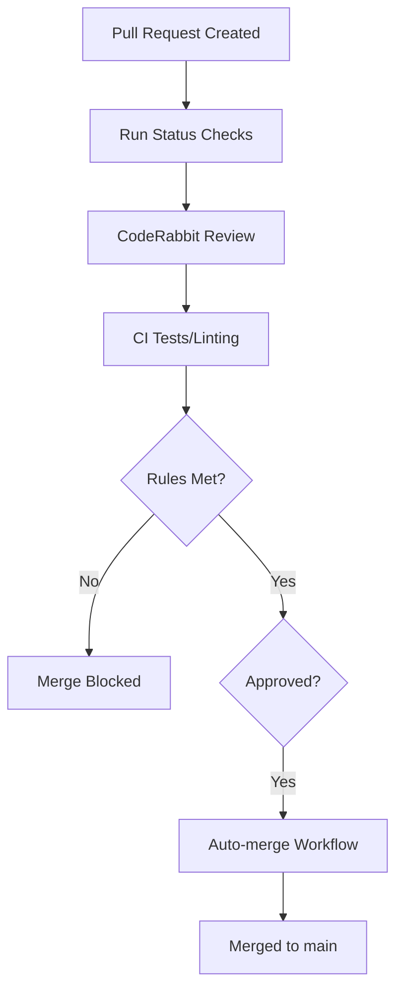

Relevant source files

The following files were used as context for generating this wiki page:

- [.github/workflows/auto-merge.yml](.github/workflows/auto-merge.yml)
- [README.md](README.md)
- [branch-ruleset-template.json](branch-ruleset-template.json)
- [apply-ruleset.sh](apply-ruleset.sh)
- [AGENTS.md](AGENTS.md)
- [SECURITY.md](SECURITY.md)

# Auto-merge Workflow

The **Auto-merge Workflow** is a core automation component of the `repo-standard` repository architecture. Its primary purpose is to streamline the integration of code changes by automatically merging Pull Requests (PRs) that meet predefined quality and security criteria. This workflow is part of a broader "gold standard" template designed to ensure consistency across all repositories within the organization.

The workflow operates in conjunction with strict branch protection rules and automated status checks to maintain the integrity of the `main` branch. It specifically addresses the needs of automated dependency updates and AI-driven code reviews, reducing manual overhead for maintainers while enforcing high security and quality standards.

Sources: [README.md:1-5](README.md#L1-L5), [README.md:19-21](README.md#L19-L21)

## Workflow Architecture and Integration

The auto-merge capability is not a standalone script but a coordinated system involving GitHub Actions, branch rulesets, and external integrations like CodeRabbit and Dependabot.

### Branch Protection and Status Checks
To prevent unstable code from being merged, the system utilizes a branch ruleset template that mandates specific conditions before a merge can occur. These rules are enforced on the `main` branch to ensure that the auto-merge workflow only triggers when the PR is fully validated.

The following table summarizes the key enforcement parameters defined in the standard configuration:

| Parameter | Value | Description |
|-----------|-------|-------------|
| Target Branch | `refs/heads/main` | The workflow and rules apply specifically to the primary branch. |
| Enforcement | `active` | Rules are strictly enforced and cannot be bypassed by standard users. |
| Required Reviews | 1 | At least one approving review is mandatory. |
| Status Checks | CodeRabbit | A required status check from the CodeRabbit integration (ID: 347564). |
| Merge Methods | Squash, Rebase | Only clean history merge methods are permitted. |

Sources: [branch-ruleset-template.json:1-42](branch-ruleset-template.json#L1-L42), [apply-ruleset.sh:13-16](apply-ruleset.sh#L13-L16)

### Visual Workflow Flowchart
The following diagram illustrates the logic gate through which a Pull Request must pass before the auto-merge workflow can successfully complete the integration.

The diagram shows the sequence from PR creation through CodeRabbit review and CI testing to final integration via the Auto-merge Workflow.
Sources: [README.md:27-30](README.md#L27-L30), [branch-ruleset-template.json:15-40](branch-ruleset-template.json#L15-L40)

## Automation Components

### CodeRabbit Integration
CodeRabbit is a critical dependency for the auto-merge process. It is configured as a `required_status_checks` policy. If CodeRabbit fails to provide a review—often due to rate limiting (5 reviews/hour org-wide)—the merge is permanently blocked. To mitigate this, a complementary `coderabbit-rewake.yml` workflow exists to re-trigger reviews if they stall.

Sources: [README.md:31-38](README.md#L31-L38), [branch-ruleset-template.json:34-42](branch-ruleset-template.json#L34-L42)

### Dependency Management
The auto-merge system is heavily utilized for dependency updates via Dependabot. To avoid hitting CodeRabbit rate limits which would block auto-merges, repositories follow a strict scheduling window.

| Repo | Schedule Window (UTC) |
|------|-----------------------|
| repo-standard | Wednesday 02:00–02:30 |
| ops-hub | Wednesday 01:00–01:30 |
| bastion | Wednesday 22:00–22:30 |

Sources: [README.md:40-60](README.md#L40-L60)

## Security and Permissions

The auto-merge workflow operates under strict security constraints to prevent unauthorized code execution or privilege escalation.

### AI Agent Restrictions
While AI agents are permitted to create branches and open PRs, they are explicitly forbidden from merging them. The `apply-ruleset.sh` script, which configures the environment for auto-merging, must be run by a human operator because branch protection API changes are blocked for agents.

| Action | Allowed for Agents |
|--------|-------------------|
| Create Branch | Yes |
| Modify Code | Yes |
| Open PRs | Yes |
| Merge PRs | **No** |
| Modify Secrets | **No** |

Sources: [AGENTS.md:12-23](AGENTS.md#L12-L23), [apply-ruleset.sh:2-5](apply-ruleset.sh#L2-L5)

### Vulnerability Management
Security is maintained through automated scanning (CodeQL) and a private reporting policy. The auto-merge workflow only proceeds if security alerts and dependency vulnerabilities are addressed, as defined in the `SECURITY.md` guidelines.
Sources: [SECURITY.md:1-20](SECURITY.md#L1-L20), [README.md:21-23](README.md#L21-L23)

## Summary
The Auto-merge Workflow in the `repo-standard` ecosystem provides a robust, automated path for code integration. By balancing high-velocity automation (Dependabot, AI reviews) with strict branch protection rules and human-enforced configuration, it ensures that only secure, reviewed, and tested code reaches the production branch.
