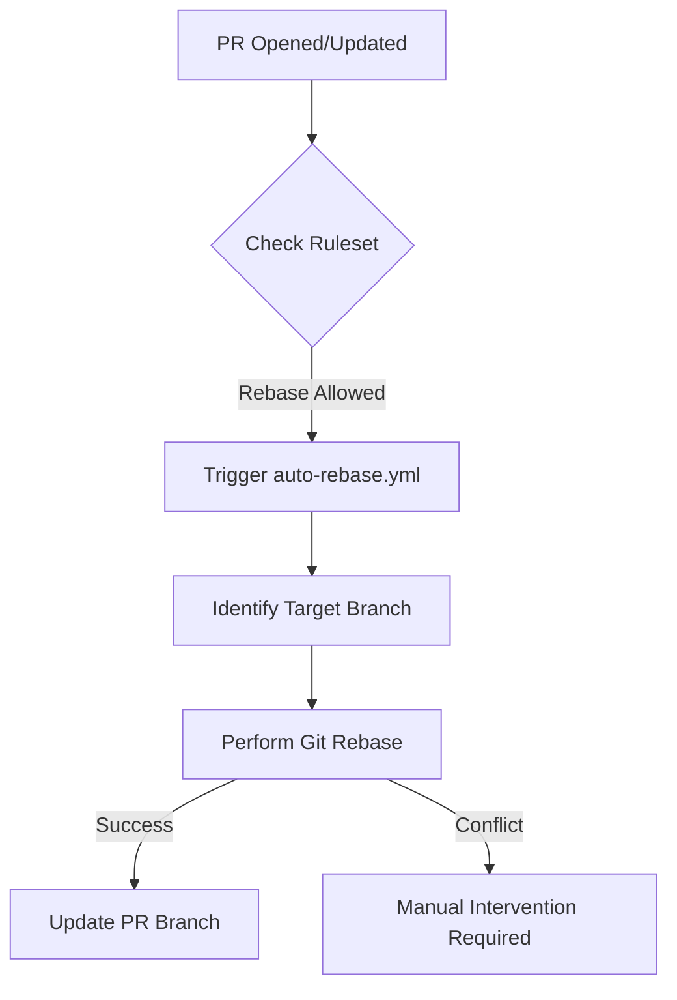

<details>
<summary>Relevant source files</summary>

The following files were used as context for generating this wiki page:

- [README.md](../../../README.md)
- [.github/workflows/auto-rebase.yml](../../../.github/workflows/auto-rebase.yml)
- [branch-ruleset-template.json](../../../branch-ruleset-template.json)
- [AGENTS.md](../../../AGENTS.md)
- [apply-ruleset.sh](../../../apply-ruleset.sh)
- [SECURITY.md](../../../SECURITY.md)
</details>

# Auto-rebase Workflow

The Auto-rebase workflow is a core automation component of the `repo-standard` template, designed to maintain clean commit histories across the organization's repositories. It functions as part of a suite of standard workflows that ensure consistency and streamline development operations.

This workflow is specifically integrated into the project's branch protection strategy, which supports linear and clean history management through rebase and squash operations. By automating the rebase process, the system reduces manual overhead for developers and ensures that Pull Requests (PRs) remain compatible with the target branch's current state.

Sources: [README.md:21-25](../../../README.md#L21-L25), [branch-ruleset-template.json:15-30](../../../branch-ruleset-template.json#L15-L30)

## Integration with Branch Rulesets

The Auto-rebase workflow operates within the constraints of the repository's branch protection rules. The standard configuration for the `main` branch explicitly permits and encourages specific merge methods that align with a rebase-centric workflow.

### Allowed Merge Methods
The system is configured to support:
- **Squash**: Consolidates all commits from a PR into a single commit on the target branch.
- **Rebase**: Applies individual commits from the feature branch onto the tip of the target branch.

Sources: [branch-ruleset-template.json:25-29](../../../branch-ruleset-template.json#L25-L29)

### Relationship with Status Checks
Branch protection rules require specific status checks to pass before a merge can occur. The Auto-rebase workflow ensures that the branch remains up-to-date, which is often a prerequisite for these checks (like CodeRabbit) to be valid.

Sources: [README.md:27-31](../../../README.md#L27-L31), [branch-ruleset-template.json:37-45](../../../branch-ruleset-template.json#L37-L45)

## Workflow Architecture and Logic

The workflow is triggered by repository events to ensure that open Pull Requests are synchronized with the `main` branch. This is essential in a high-activity environment where the `main` branch evolves frequently.

### Automation Flow
The following diagram illustrates how the automation interacts with Pull Requests and the repository structure:



The workflow ensures that feature branches are continuously aligned with the `main` branch to prevent stale code.

Sources: [README.md:21-23](../../../README.md#L21-L23), [branch-ruleset-template.json:8-13](../../../branch-ruleset-template.json#L8-L13)

## Developer and Agent Constraints

The project defines clear boundaries for how both human contributors and AI agents interact with the repository's branching and merging logic.

| Actor | Allowed Actions | Forbidden Actions |
| :--- | :--- | :--- |
| **AI Agents** | Create branches, modify code, run tests, open PRs | Push to main, merge PRs, force push |
| **Maintainers** | Apply rulesets, manage branch protection, merge PRs | Bypassing required status checks |

Sources: [AGENTS.md:10-21](../../../AGENTS.md#L10-L21), [apply-ruleset.sh:2-5](../../../apply-ruleset.sh#L2-L5)

### Prohibited Operations for Agents
AI agents are strictly forbidden from force-pushing or pushing directly to `main`. This makes the `auto-rebase.yml` workflow critical, as it provides a controlled, automated mechanism for updating branches that agents themselves cannot perform via direct push.

Sources: [AGENTS.md:15-21](../../../AGENTS.md#L15-L21)

## Implementation Details

The configuration for branch protection and rebase behavior is defined in a JSON template and applied via a shell script.

### Ruleset Configuration Summary
| Parameter | Value | Description |
| :--- | :--- | :--- |
| `name` | Protect main | Name of the ruleset |
| `enforcement` | active | Rules are strictly enforced |
| `required_approving_review_count` | 1 | Minimum reviews required for PRs |
| `allowed_merge_methods` | squash, rebase | Permitted merge strategies |
| `strict_required_status_checks_policy` | true | Branches must be up to date before merging |

Sources: [branch-ruleset-template.json:2-45](../../../branch-ruleset-template.json#L2-L45)

### Manual Application
While the rebase process is automated once a PR is active, the ruleset governing this behavior must be applied manually by a maintainer using the `apply-ruleset.sh` script to ensure security.

```bash
# Usage: ./apply-ruleset.sh <repo-namn>
gh api --method POST "repos/blixten85/$REPO/rulesets" --input "branch-ruleset-template.json"
```

Sources: [apply-ruleset.sh:10-12](../../../apply-ruleset.sh#L10-L12)

## Security and Compliance

The Auto-rebase workflow adheres to the project's security policy by ensuring that no sensitive data (secrets, keys, or passwords) is introduced or persisted during the automated rebase process.

### Security Best Practices
1. **Never commit secrets**: Verified through workflows and status checks like CodeQL.
2. **Review dependencies**: Dependabot updates are handled in specific windows to avoid conflict with automated workflows.
3. **Audit logs**: All automated rebase actions are recorded in the GitHub Actions logs.

Sources: [SECURITY.md:43-52](../../../SECURITY.md#L43-L52), [README.md:35-40](../../../README.md#L35-L40)

The Auto-rebase workflow is a vital part of the `repo-standard` automation suite. By ensuring branches are consistently updated against the `main` branch using approved rebase and squash methods, it maintains repository health and supports the project's strict policy against direct pushes to protected branches.
