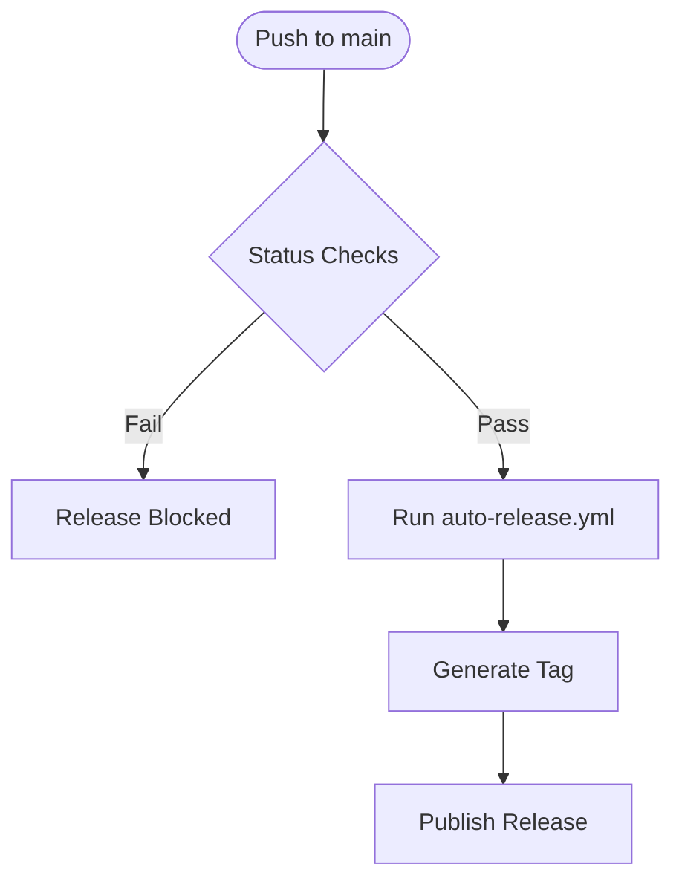
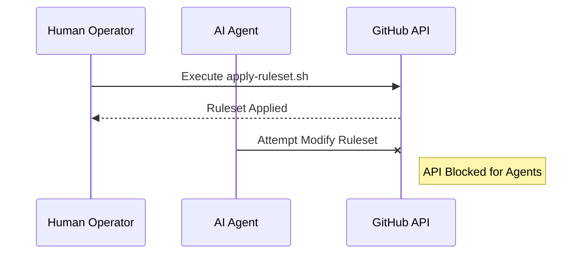

Relevant source files

The following files were used as context for generating this wiki page:

- [.github/workflows/auto-release.yml](.github/workflows/auto-release.yml)
- [README.md](README.md)
- [branch-ruleset-template.json](branch-ruleset-template.json)
- [apply-ruleset.sh](apply-ruleset.sh)
- [AGENTS.md](AGENTS.md)

# Auto-release Workflow

The Auto-release Workflow is a core automation component within the `repo-standard` framework, designed to standardize and streamline the process of generating software releases. It operates as part of a suite of ten standard workflows that ensure consistency across all repositories within the organization.

This system works in conjunction with branch protection rules and CI/CD automation to maintain a high-quality codebase. By automating the release process, it reduces manual intervention and ensures that every release adheres to the established repository standards.

Sources: [README.md:16](README.md#L16), [README.md:21-23](README.md#L21-L23)

## Workflow Architecture and Integration

The auto-release process is deeply integrated with the repository's branch management and security policies. It is categorized as a "core automation" workflow alongside tools like `auto-merge` and `ci-autofix`.

### Trigger and Execution Flow

The workflow is designed to execute within the context of a protected `main` branch. Release automation typically follows the successful passing of required status checks, such as CodeRabbit reviews and project-specific CI jobs (linting, testing, etc.).

The diagram above illustrates the high-level logic where releases are contingent upon passing mandatory status checks.
Sources: [README.md:21-30](README.md#L21-L30), [branch-ruleset-template.json:34-51](branch-ruleset-template.json#L34-L51)

### Relationship with Branch Rules

The `auto-release.yml` workflow relies on the enforcement of branch rules defined in `branch-ruleset-template.json`. These rules prevent direct pushes to the `main` branch and require pull requests with at least one approving review. This ensures that only reviewed and validated code reaches the stage where a release can be triggered.

| Component | Function | Configuration File |
| :--- | :--- | :--- |
| **Branch Protection** | Restricts `main` branch access | `branch-ruleset-template.json` |
| **Automation Workflow** | Executes release logic | `.github/workflows/auto-release.yml` |
| **Ruleset Applicator** | Deploys protection to new repos | `apply-ruleset.sh` |

Sources: [branch-ruleset-template.json:1-33](branch-ruleset-template.json#L1-L33), [apply-ruleset.sh:1-10](apply-ruleset.sh#L1-L10)

## Security and Permissions

Release operations are subject to strict security constraints, particularly regarding AI agent interactions and credential management.

### Agent Restrictions

According to the AI Agent Guide, while agents are allowed to create branches and open PRs, they are strictly forbidden from performing actions that could compromise release integrity, such as:
*  Pushing directly to `main`.
*  Merging Pull Requests.
*  Modifying GitHub organization settings.

Sources: [AGENTS.md:10-21](AGENTS.md#L10-L21)

### Protected Operations

The application of branch rulesets—which define the environment in which the auto-release workflow operates—is restricted to manual execution. The `apply-ruleset.sh` script explicitly blocks agents from making branch protection changes, as these fall under the "CI Bypass" category.

The diagram shows that security-critical configurations supporting the release environment must be performed by a human operator.
Sources: [apply-ruleset.sh:2-5](apply-ruleset.sh#L2-L5), [AGENTS.md:16-21](AGENTS.md#L16-L21)

## Implementation in New Repositories

When a new repository is created using the `repo-standard` template, the auto-release workflow is initialized as follows:

1.  **File Transfer:** All workflow files, including `auto-release.yml`, are copied to the new repository.
2.  **Ruleset Application:** The operator runs `./apply-ruleset.sh <repo-name>` to activate the protection layers required for safe releases.
3.  **Status Check Configuration:** Users must manually add repository-specific CI jobs (e.g., `test`, `lint`) to the `required_status_checks` list via the GitHub API to ensure the release workflow only triggers on healthy code.

Sources: [README.md:71-80](README.md#L71-L80), [apply-ruleset.sh:11-14](apply-ruleset.sh#L11-L14)

## Summary

The Auto-release Workflow provides a standardized mechanism for software delivery within the `repo-standard` ecosystem. By anchoring the release process in a protected branch environment with mandatory status checks and human-only security configurations, it ensures that every release is both automated and secure.
