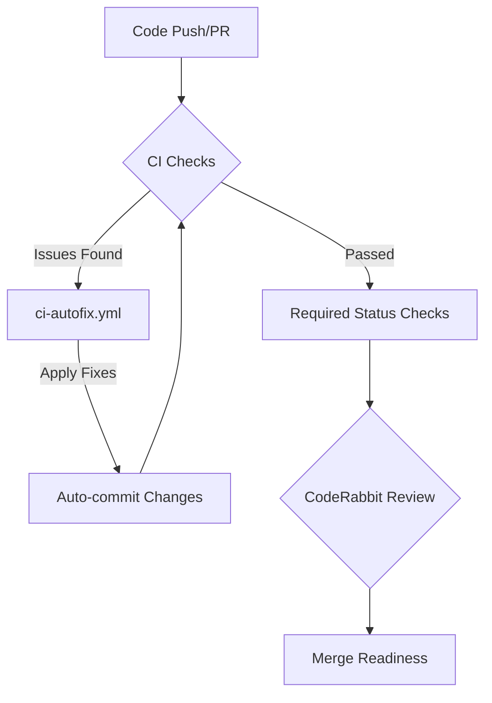

<details>
<summary>Relevant source files</summary>

The following files were used as context for generating this wiki page:

- [.github/workflows/ci-autofix.yml](.github/workflows/ci-autofix.yml)
- [README.md](README.md)
- [AGENTS.md](AGENTS.md)
- [branch-ruleset-template.json](branch-ruleset-template.json)
- [apply-ruleset.sh](apply-ruleset.sh)
</details>

# CI Autofix Automation

CI Autofix Automation is a core component of the `repo-standard` framework designed to automate code corrections and maintenance tasks. It functions as part of a suite of "standard workflows" that ensure repository consistency across the `blixten85` organization by automatically addressing issues identified during Continuous Integration (CI) cycles.

Sources: [README.md:21-25](README.md#L21-L25)

## System Architecture

The automation is built upon GitHub Actions and is integrated into the repository's security and quality gates. It operates alongside other specialized automation workflows such as `auto-commit`, `auto-label`, and `auto-release` to create a hands-off maintenance environment.

### Workflow Integration

The `ci-autofix.yml` workflow is categorized as "kärnautomation" (core automation). It is designed to work in tandem with branch protection rules defined in the project's ruleset templates.

Sources: [README.md:22-25](README.md#L22-L25), [branch-ruleset-template.json:1-40](branch-ruleset-template.json#L1-L40)



The diagram above illustrates how the autofix workflow interacts with standard CI checks and the CodeRabbit review process to ensure code quality before merging.
Sources: [README.md:25-30](README.md#L25-L30), [.github/workflows/ci-autofix.yml](.github/workflows/ci-autofix.yml)

## Configuration and Constraints

The automation is subject to specific organizational constraints, particularly regarding AI agent permissions and branch protection.

### Agent Permissions

While CI workflows can modify code and run tests, there are strict boundaries for AI agents to prevent unauthorized repository modifications.

| Permission Category | Allowed Actions | Forbidden Actions |
| :--- | :--- | :--- |
| **Code Management** | Create branches, Modify code | Push directly to main, Merge PRs |
| **Repository Ops** | Run tests, Open PRs | Delete branches, Disable workflows |
| **Security** | - | Modify secrets, Change Org settings |

Sources: [AGENTS.md:9-25](AGENTS.md#L9-L25)

### Branch Protection Rules

The project uses a standard ruleset (`branch-ruleset-template.json`) to protect the `main` branch. This ruleset enforces that all changes must go through a Pull Request and pass required status checks, specifically CodeRabbit.

*  **Enforcement:** Active on `refs/heads/main`.
*  **Approval Requirements:** Minimum of 1 approving review.
*  **Merge Methods:** Restricted to `squash` and `rebase`.
*  **Status Checks:** Strict policy requiring the "CodeRabbit" context (Integration ID: 347564).

Sources: [branch-ruleset-template.json:1-53](branch-ruleset-template.json#L1-L53), [apply-ruleset.sh:10-15](apply-ruleset.sh#L10-L15)

## Implementation Details

The application of these automation standards is managed through the `apply-ruleset.sh` script, which requires a positional repository argument and directly invokes `gh api` to apply the JSON template to a target repository.

```bash
#!/bin/bash
# Sources: [apply-ruleset.sh:1-11]
set -euo pipefail
REPO="${1:?Usage: ./apply-ruleset.sh <repo-namn>}"
gh api --method POST "repos/blixten85/$REPO/rulesets" --input "$(dirname "$0")/branch-ruleset-template.json"
```

### Automation Rate Limiting

A critical aspect of the automation ecosystem is the management of the CodeRabbit rate limit (5 reviews/hour organization-wide). To prevent CI Autofix or Dependabot PRs from being permanently blocked, the project implements a strict scheduling strategy for dependency updates.

| Update Window | Repositories |
| :--- | :--- |
| Wednesday Night | `bastion`, `scraper`, `ops-hub`, `repo-standard`, etc. |
| Saturday Night | `pastebinit`, `routines-relay`, `filtered-movies`, etc. |

Sources: [README.md:37-65](README.md#L37-L65)

## Summary

CI Autofix Automation in `repo-standard` provides a standardized method for maintaining code health. By combining GitHub Actions (`ci-autofix.yml`), strict branch rules, and coordinated scheduling to avoid rate limits, the system ensures that repositories remain compliant with organizational standards with minimal manual intervention.
