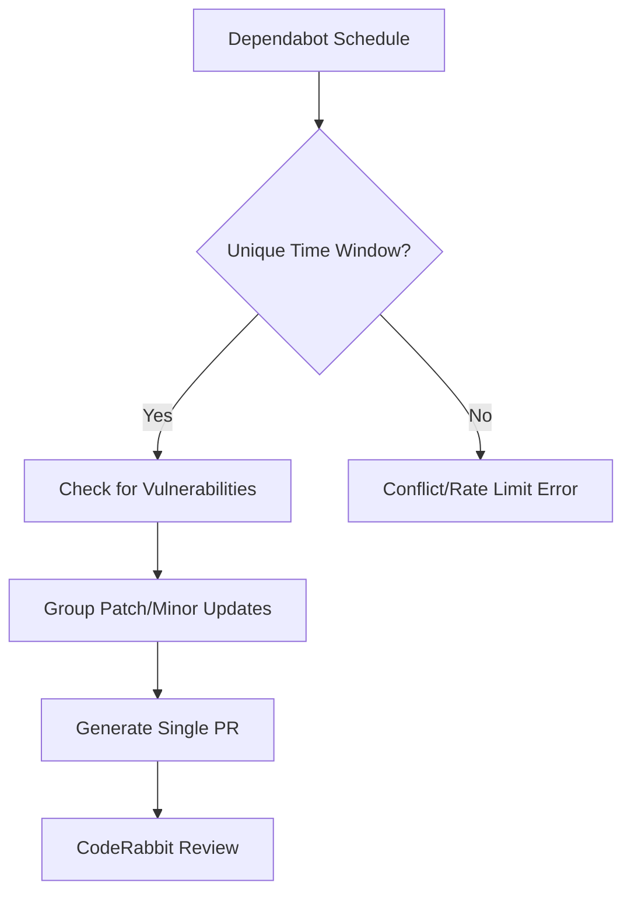
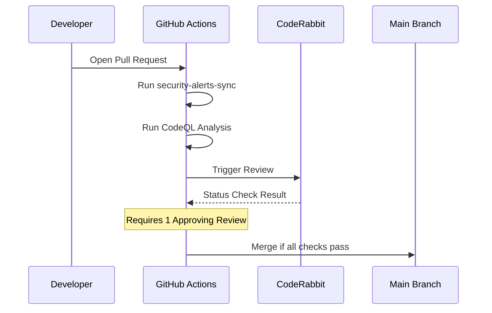

Relevant source files

The following files were used as context for generating this wiki page:

- [.github/workflows/security-alerts-sync.yml](../../../.github/workflows/security-alerts-sync.yml)
- [SECURITY.md](../../../SECURITY.md)
- [README.md](../../../README.md)
- [branch-ruleset-template.json](../../../branch-ruleset-template.json)
- [AGENTS.md](../../../AGENTS.md)

# Security Alerts Syncing

## Introduction
Security Alerts Syncing is a core automation component within the `repo-standard` framework designed to maintain the security integrity of repositories across the blixten85 organization. Its primary purpose is to automate the synchronization and management of security vulnerabilities, ensuring that repositories adhere to a unified security policy and leverage automated tools for detection and remediation.

The system integrates GitHub-native features like Dependabot and CodeQL with custom workflows to provide a standardized security posture. This includes automated dependency updates, vulnerability reporting protocols, and strict branch protection rules to prevent the introduction of insecure code.

Sources: [README.md:21-30](../../../README.md#L21-L30), [SECURITY.md:1-10](../../../SECURITY.md#L1-L10)

## Architecture and Components

The security synchronization architecture relies on a combination of configuration files, CI/CD workflows, and organizational policies.

### Core Security Workflows
The automation is driven by specific GitHub Action workflows located in `.github/workflows/`. These workflows handle the "syncing" aspect by ensuring security alerts and fixes are processed consistently.

| Workflow | Function |
| :--- | :--- |
| `security-alerts-sync.yml` | Coordinates the synchronization of security alerts across the repository. |
| `codeql.yml` | Performs static analysis to detect injection-sensitive surfaces and other vulnerabilities. |

Sources: [README.md:21-26](../../../README.md#L21-L26), [.github/workflows/security-alerts-sync.yml](../../../.github/workflows/security-alerts-sync.yml)

### Dependency Management Configuration
Dependabot configuration is managed under `.github/`.

| Configuration File | Responsibility |
| :--- | :--- |
| `dependabot.yml` | Automatically updates third-party dependencies to patch known vulnerabilities. |

Sources: [README.md:12](../../../README.md#L12)

### Automated Dependency Management
Dependabot is used to monitor third-party dependencies. To avoid rate-limiting issues with automated review tools like CodeRabbit, `repo-standard` enforces a strict scheduling policy for these updates.

The diagram shows the logic for dependency syncing, highlighting the requirement for unique time windows to prevent organizational rate limits.

Sources: [README.md:33-45](../../../README.md#L33-L45)

## Security Policy and Reporting

The `SECURITY.md` file defines the standard protocol for handling discovered vulnerabilities. This policy ensures that security alerts are not just technical triggers but part of a managed response lifecycle.

### Reporting Workflow
Vulnerabilities are managed through private reporting channels rather than public issues to prevent exploitation before a fix is available.

| Stage | Timeframe |
| :--- | :--- |
| Initial acknowledgment | Within 48 hours |
| Assessment | Within 5 business days |
| Fix implementation | Based on severity |
| Public disclosure | After fix release |

Sources: [SECURITY.md:3-17](../../../SECURITY.md#L3-L17)

### Encryption and Secret Management
A critical aspect of security syncing is ensuring that secrets (tokens, keys) are never exposed during the automation or synchronization process. 
- **Encryption**: Data is encrypted using AES-256-GCM + PBKDF2 before leaving the device/system.
- **Storage**: Tokens are stored in system keychains (iOS/macOS) rather than plaintext.
- **Forbidden Actions**: AI agents are explicitly forbidden from modifying secrets or changing organization settings.

Sources: [SECURITY.md:39-44](../../../SECURITY.md#L39-L44), [AGENTS.md:14-19](../../../AGENTS.md#L14-L19)

## Implementation and Enforcement

Security standards are enforced through GitHub Branch Rulesets, which ensure that no code bypasses the security checks defined in the synchronization workflows.

### Branch Protection Rules
The `branch-ruleset-template.json` defines the mandatory checks that must pass before code can be merged into the `main` branch. This serves as the final gate for the security syncing process. Note that CodeQL Analysis and security-alerts-sync workflows are advisory unless their specific status contexts are configured as required checks in the ruleset.

The sequence diagram illustrates how security checks are integrated into the PR lifecycle. Non-fast-forward pushes are prohibited by the ruleset, and CodeQL is required only when its status context is explicitly configured.

Sources: [branch-ruleset-template.json:30-45](../../../branch-ruleset-template.json#L30-L45), [apply-ruleset.sh:13-16](../../../apply-ruleset.sh#L13-L16)

### AI Agent Restrictions
To maintain the integrity of security configurations, certain actions are restricted from automated agents:
- **Prohibited**: Pushing to `main`, merging PRs, modifying secrets, and disabling workflows.
- **Mandatory**: All tests must pass, and credentials must never be committed.

Sources: [AGENTS.md:14-25](../../../AGENTS.md#L14-L25)

## Summary
Security Alerts Syncing in the `repo-standard` repository provides a template for automated vulnerability management. By combining scheduled dependency updates, static analysis through CodeQL, and strict branch protection rules, the system ensures that security is a continuous, synchronized process rather than a manual checklist. This structured approach protects sensitive data, such as SSH keys and OAuth tokens, while maintaining a high velocity for dependency maintenance.
