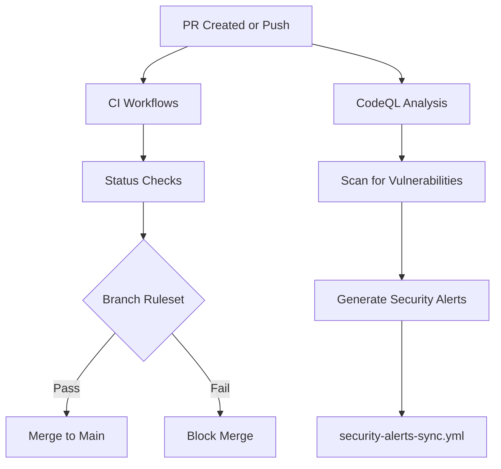
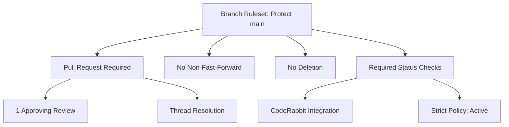

Relevant source files

The following files were used as context for generating this wiki page:

- [.github/workflows/codeql.yml](../../../.github/workflows/codeql.yml)
- [README.md](../../../README.md)
- [SECURITY.md](../../../SECURITY.md)
- [branch-ruleset-template.json](../../../branch-ruleset-template.json)
- [apply-ruleset.sh](../../../apply-ruleset.sh)
- [AGENTS.md](../../../AGENTS.md)

# CodeQL Analysis Setup

## Introduction

The CodeQL Analysis Setup is a core component of the `repo-standard` repository, serving as a template for automated security scanning across the `blixten85` organization. Its primary purpose is to identify vulnerabilities, particularly injection-sensitive areas, by performing semantic analysis of the source code. CodeQL is integrated as a standard GitHub Actions workflow, providing automated security oversight for public repositories.

Sources: [README.md:27-29](../../../README.md#L27-L29), [SECURITY.md:24-27](../../../SECURITY.md#L24-L27)

## Workflow Architecture and Integration

CodeQL is part of a suite of 10 standard workflows provided in the template repository. It is designed to work alongside other automation tools like Dependabot and CodeRabbit to maintain repository health and security.

### Core Components

The analysis system is built upon the following elements:
- **Workflow File:** `.github/workflows/codeql.yml` handles the execution of the scan.
- **Security Policy:** Defined in `SECURITY.md`, establishing the scope of what needs protection, such as SSH transport, authentication, and OAuth integrations.
- **Branch Protection:** Integrated via `branch-ruleset-template.json`, which ensures that security checks are respected before code is merged into the `main` branch.

Sources: [README.md:21-31](../../../README.md#L21-L31), [SECURITY.md:18-27](../../../SECURITY.md#L18-L27), [branch-ruleset-template.json:1-12](../../../branch-ruleset-template.json#L1-L12)

### Process Flow

The following diagram illustrates how CodeQL fits into the standard repository automation flow:

The diagram shows the parallel execution of CodeQL alongside other CI workflows and its eventual role in the branch protection logic.
Sources: [README.md:21-29](../../../README.md#L21-L29), [branch-ruleset-template.json:43-55](../../../branch-ruleset-template.json#L43-L55)

## Configuration and Deployment

The setup is intended to be copied from `repo-standard` to new repositories. While the CodeQL workflow itself is pre-configured, its enforcement is managed through branch rulesets.

### Deployment Steps
1. Files are copied to the new repository.
2. The `apply-ruleset.sh` script is executed manually to establish branch protection on `main`.
3. Repo-specific CI job names (e.g., `lint`, `test`) are manually added to the `required_status_checks`.

Sources: [README.md:83-93](../../../README.md#L83-L93), [apply-ruleset.sh:10-14](../../../apply-ruleset.sh#L10-L14)

### Security Scope and Responsibilities

| Component | Responsibility | Relevant Files |
|---|---|---|
| SSHCore | SSH transport, authentication, sync-encryption | `SECURITY.md` |
| App/ | OAuth integration, Keychain management | `SECURITY.md` |
| Workflows | Automation of security scans | `.github/workflows/` |
| Dependabot | Automatic dependency updates | `.github/dependabot.yml` |

Sources: [SECURITY.md:18-27](../../../SECURITY.md#L18-L27), [README.md:21-25](../../../README.md#L21-L25)

## Branch Protection and Security Enforcement

Security is enforced through a strict ruleset defined in `branch-ruleset-template.json`. This template ensures that the `main` branch is protected from direct pushes and requires status checks to pass.

### Ruleset Logic
The ruleset specifies that:
- **Non-fast-forward pushes** and **Deletions** are prohibited on `main`.
- **Pull Requests** require at least one approving review and resolution of all threads.
- **Status Checks** must pass, including CodeRabbit. CodeQL is required only when its status context is explicitly configured in the ruleset.

The diagram visualizes the hierarchy of rules applied to the main branch to ensure code quality and security.
Sources: [branch-ruleset-template.json:13-57](../../../branch-ruleset-template.json#L13-L57), [apply-ruleset.sh:11-13](../../../apply-ruleset.sh#L11-L13)

### Agent Restrictions
AI agents are explicitly forbidden from modifying security-critical settings. This is a manual-only process to prevent unauthorized changes to the security posture.
- **Forbidden:** Modify secrets, change GitHub org settings, or merge PRs.
- **Execution:** `apply-ruleset.sh` must be run by a human operator, not an agent.

Sources: [AGENTS.md:12-18](../../../AGENTS.md#L12-L18), [apply-ruleset.sh:2-4](../../../apply-ruleset.sh#L2-L4)

## Summary

The CodeQL Analysis Setup provides a standardized security framework for all repositories within the organization. By combining automated scanning with strict branch rulesets and human-in-the-loop deployment, it ensures that vulnerabilities are identified and blocked from reaching the production branch. This multi-layered approach covers source code analysis, dependency management, and access control.
