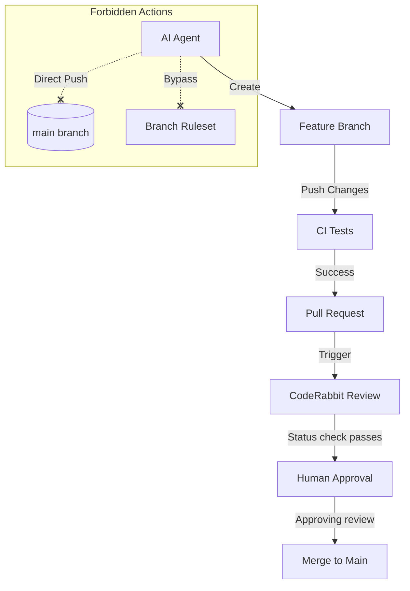

<details>
<summary>Relevant source files</summary>

The following files were used as context for generating this wiki page:

- [AGENTS.md](../../../AGENTS.md)
- [README.md](../../../README.md)
- [CLAUDE.md](../../../CLAUDE.md)
- [SECURITY.md](../../../SECURITY.md)
- [branch-ruleset-template.json](../../../branch-ruleset-template.json)
- [apply-ruleset.sh](../../../apply-ruleset.sh)
</details>

# General AI Agent Guide

## Introduction
The General AI Agent Guide defines the operational framework, constraints, and integration standards for AI agents (such as Claude and CodeRabbit) within the `repo-standard` ecosystem. This project serves as a "gold standard" template for repositories in the `blixten85` organization, ensuring consistent behavior across automated contributors.

The guide outlines specific permissions for agents, mandatory security protocols regarding credential handling, and the integration of automated review systems into the GitHub workflow. It focuses on maintaining repository integrity through strict branch protection rules and scheduled dependency management to avoid infrastructure bottlenecks.

Sources: [README.md:1-5](README.md#L1-L5), [AGENTS.md:1-5](AGENTS.md#L1-L5)

## Agent Operational Framework

AI agents operating within this project are subject to a strict set of allowed and forbidden actions to ensure security and code quality. These rules are enforced both through policy documentation and technical branch protection mechanisms.

### Permissions and Restrictions
Agents are encouraged to perform constructive development tasks but are strictly barred from administrative or destructive operations.

| Category | Action |
| :--- | :--- |
| **Allowed** | Create branches, modify code, run tests, open Pull Requests |
| **Forbidden** | Push to `main`, merge PRs, delete branches, disable workflows, modify secrets |
| **Requirements** | Pass all tests, keep PRs focused, no unrelated changes, no credentials |

Sources: [AGENTS.md:10-25](AGENTS.md#L10-L25)

### Branch Protection Logic
The repository utilizes a standard ruleset to protect the `main` branch. This ruleset ensures that AI agents cannot bypass quality checks or administrative controls.



The diagram illustrates the intended workflow for an agent, highlighting that direct interaction with the `main` branch is blocked by the organization's branch ruleset.

Sources: [AGENTS.md:16-17](AGENTS.md#L16-L17), [branch-ruleset-template.json:1-45](branch-ruleset-template.json#L1-L45), [apply-ruleset.sh:2-5](apply-ruleset.sh#L2-L5)

## AI Integration and Automation

The project integrates specific AI tools to automate code review and response, primarily CodeRabbit and Claude.

### CodeRabbit Integration
CodeRabbit provides automated reviews for Pull Requests. Due to organizational rate limits (5 reviews per hour across the organization), the project implements a strict scheduling system for Dependabot updates to prevent review blockages.

*  **Required Status Check**: CodeRabbit is configured as a mandatory check in `branch-ruleset-template.json`.
*  **Rate Limit Management**: Repositories are assigned specific 30-minute windows on Wednesday and Saturday nights for dependency updates.
*  **Rewake Mechanism**: A dedicated workflow (`coderabbit-rewake.yml`) exists to re-trigger reviews if they are missed due to rate limits.

Sources: [README.md:32-45](README.md#L32-L45), [branch-ruleset-template.json:44-50](branch-ruleset-template.json#L44-L50)

### Claude Code Guide
The `CLAUDE.md` file acts as a specialized instruction set for the Claude AI agent, mirroring the project-specific conventions found in `AGENTS.md`. It focuses on ensuring the agent understands the repository structure and local building/testing requirements.

Sources: [CLAUDE.md:1-10](CLAUDE.md#L1-L10)

### Claude Trigger Workflow
A specialized workflow (`claude-assign-trigger.yml`) handles agent invocation via labels.
*  **Trigger**: Based on the `ask-claude` label.
*  **Security**: Runs on `pull_request_target`, which allows it to post comments without checking out untrusted code from forks.

Sources: [README.md:27-30](README.md#L27-L30)

## Security and Credential Handling

Security is a primary constraint for all AI agent activities. Agents must adhere to the organization's security policy, which emphasizes the protection of secrets and the use of encrypted transport.

### Core Security Rules for Agents
1.  **Zero-Leak Policy**: Secrets (keys, passphrases, tokens) must never leave the device unencrypted.
2.  **Commit Restrictions**: Agents are strictly forbidden from committing credentials or modifying GitHub secrets.
3.  **Vulnerability Reporting**: Agents should not create public issues for discovered vulnerabilities but should follow the private reporting process via `dev@denied.se`.

Sources: [AGENTS.md:8-9](AGENTS.md#L8-L9), [AGENTS.md:22](AGENTS.md#L22), [SECURITY.md:5-10](SECURITY.md#L5-L10)

### Automated Security Checks
The project employs `codeql.yml` for static analysis and Dependabot for automated dependency updates. AI agents are expected to respect the findings of these tools.

Sources: [README.md:21-25](README.md#L21-L25), [SECURITY.md:46](SECURITY.md#L46)

## Implementation Configuration

The following JSON structure defines the mandatory branch protections that restrict AI agent behavior on the primary branch.

```json
{
  "name": "Protect main",
  "rules": [
    {
      "type": "pull_request",
      "parameters": {
        "required_approving_review_count": 1,
        "required_review_thread_resolution": true
      }
    },
    {
      "type": "required_status_checks",
      "parameters": {
        "required_status_checks": [
          { "context": "CodeRabbit" }
        ]
      }
    }
  ]
}
```

Sources: [branch-ruleset-template.json:1-55](branch-ruleset-template.json#L1-L55)

## Conclusion
The AI Agent Guide ensures that automated contributors operate within a safe, predictable, and highly regulated environment. By combining explicit instruction files (`AGENTS.md`, `CLAUDE.md`) with technical enforcement via branch rulesets and scheduled automation windows, the project maintains high code quality while leveraging AI for scale. These standards prevent common pitfalls such as rate-limit exhaustion, accidental secret exposure, and unauthorized branch modifications.
