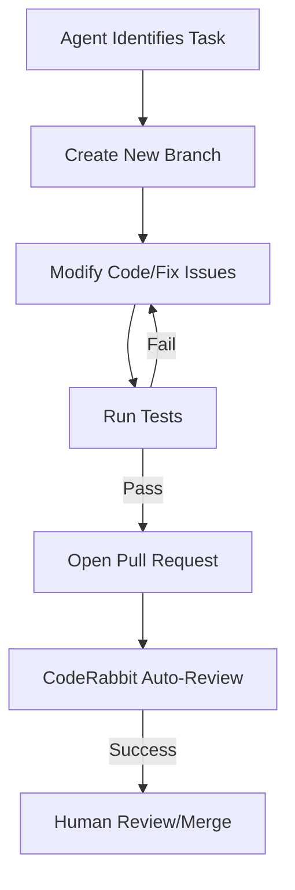
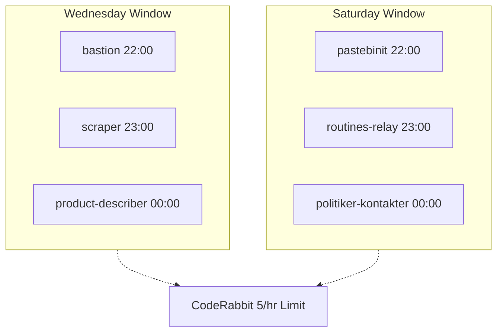

<details>
<summary>Relevant source files</summary>

The following files were used as context for generating this wiki page:

- [CLAUDE.md](../../../CLAUDE.md)
- [AGENTS.md](../../../AGENTS.md)
- [README.md](../../../README.md)
- [SECURITY.md](../../../SECURITY.md)
- [branch-ruleset-template.json](../../../branch-ruleset-template.json)
- [apply-ruleset.sh](../../../apply-ruleset.sh)
</details>

# Claude Code Conventions

Claude Code Conventions define the standardized rules, operational boundaries, and architectural guidelines for AI agents and contributors interacting with repositories within the `blixten85` organization. These conventions ensure consistent project structure, automated maintenance, and secure handling of credentials across various projects such as `bastion`, `ops-hub`, and others.

The system relies on specific configuration files like `CLAUDE.md` and `AGENTS.md` to provide context-aware instructions to AI agents, while leveraging GitHub Actions and branch rulesets to enforce quality and security standards.

Sources: [README.md:1-12](README.md#L1-L12), [CLAUDE.md:1-8](CLAUDE.md#L1-L8), [AGENTS.md:1-6](AGENTS.md#L1-L6)

## Operational Framework for AI Agents

AI agents are governed by a set of explicit permissions and restrictions designed to maintain repository integrity while allowing for automated contributions.

### Permissions and Restrictions
Agents are granted autonomy for development tasks but are strictly prohibited from administrative actions or direct manipulation of protected branches.

| Category | Allowed Actions | Forbidden Actions |
| :--- | :--- | :--- |
| **Code Management** | Create branches, modify code, open PRs | Push directly to main, merge PRs, delete branches |
| **Testing/CI** | Run tests | Disable workflows |
| **Security** | - | Modify secrets, commit credentials |
| **Configuration** | - | Change GitHub org settings |

Sources: [AGENTS.md:8-21](AGENTS.md#L8-L21), [README.md:95-98](README.md#L95-L98)

### Workflow Integration
The following diagram illustrates the lifecycle of a contribution managed under these conventions:



This workflow ensures that no code enters the `main` branch without passing automated checks and meeting the organization's quality standards.

Sources: [AGENTS.md:8-28](AGENTS.md#L8-L28), [README.md:14-30](README.md#L14-L30), [branch-ruleset-template.json:1-40](branch-ruleset-template.json#L1-L40)

## Project Architecture and Standardization

The `repo-standard` repository serves as a "Gold Standard" template. Every new repository must adopt its structure and configuration to ensure uniformity.

### Core Configuration Files
Standardization is achieved through mandatory files that define agent behavior and security policies.

*  **CLAUDE.md / AGENTS.md**: Contain AI agent instructions. Placeholders for `<repo-name>` and specific conventions must be populated.
*  **SECURITY.md**: Defines the standard security policy, including vulnerability reporting and data handling scopes.
*  **branch-ruleset-template.json**: Provides the JSON schema for protecting the `main` branch via GitHub's Rulesets feature.

Sources: [README.md:5-24](README.md#L5-L24), [CLAUDE.md:1-10](CLAUDE.md#L1-L10), [SECURITY.md:1-10](SECURITY.md#L1-L10)

### Security and Credential Management
A critical convention is the "Zero-Leak" policy for secrets.
*  **Encryption**: Keys and passwords must never leave the device unencrypted. For instance, `SSHCore/SyncCrypto.swift` uses AES-256-GCM + PBKDF2.
*  **Storage**: SSH keys and OAuth tokens are stored in system Keychains (iOS/macOS) rather than plaintext files.
*  **Bypass Restrictions**: Branch protection changes via API are intentionally blocked for agents to prevent security circumvention.

Sources: [SECURITY.md:46-64](SECURITY.md#L46-L64), [AGENTS.md:11-12](AGENTS.md#L11-L12), [apply-ruleset.sh:2-4](apply-ruleset.sh#L2-L4)

## Automation and Scheduling

To manage API rate limits, specifically for CodeRabbit reviews, the conventions dictate a strict scheduling policy for dependency updates.

### CodeRabbit Rate-Limit Management
CodeRabbit has a limit of 5 reviews per hour across the entire organization. To avoid permanent PR blockages, `dependabot.yml` schedules are staggered.



The distribution minimizes competition between automated updates and manual usage. All patch/minor updates are grouped into a single PR per run.

Sources: [README.md:41-76](README.md#L41-L76)

### Standard Workflows
The repository includes 10 core workflows for automation:
*  **Maintenance**: `auto-commit`, `auto-label`, `auto-merge`, `auto-rebase`, `auto-release`, `ci-autofix`.
*  **Security**: `codeql.yml` (static analysis), `security-alerts-sync.yml`.
*  **Review Resilience**: `coderabbit-rewake.yml`.
*  **Claude Integration**: `claude-assign-trigger.yml` uses the `ask-claude` label to trigger agent interaction safely.

Sources: [README.md:26-38](README.md#L26-L38)

## Branch Protection Rules

Branch protection is enforced using GitHub Rulesets. The configuration is applied via `apply-ruleset.sh` to the `main` branch.

### Ruleset Configuration
The standard ruleset requires at least one approving review and mandates successful status checks.

```json
{
  "type": "pull_request",
  "parameters": {
    "required_approving_review_count": 1,
    "required_review_thread_resolution": true,
    "allowed_merge_methods": ["squash", "rebase"]
  }
}
```

Sources: [branch-ruleset-template.json:15-30](branch-ruleset-template.json#L15-L30)

### Implementation Script
The `apply-ruleset.sh` script automates the deployment of these rules.

```bash
#!/bin/bash
REPO="${1:?Usage: ./apply-ruleset.sh <repo-name>}"
gh api --method POST "repos/blixten85/$REPO/rulesets" --input "$(dirname "$0")/branch-ruleset-template.json"
```

Sources: [apply-ruleset.sh:8-11](apply-ruleset.sh#L8-L11)

Claude Code Conventions provide a robust framework for balancing AI-driven automation with organizational security. By adhering to these standardized file structures, scheduling windows, and permission models, the project maintains a high-quality codebase while mitigating the risks associated with automated agents.

Sources: [README.md:1-5](README.md#L1-L5), [AGENTS.md:23-28](AGENTS.md#L23-L28)
