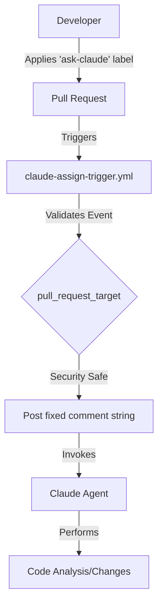
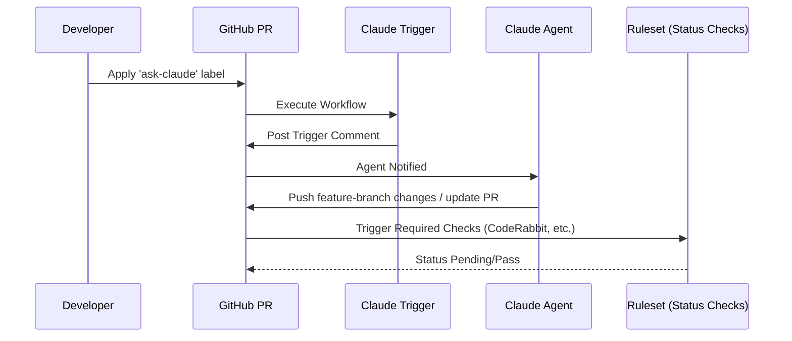

Relevant source files

The following files were used as context for generating this wiki page:

- [.github/workflows/claude-assign-trigger.yml](../../../.github/workflows/claude-assign-trigger.yml)
- [README.md](../../../README.md)
- [AGENTS.md](../../../AGENTS.md)
- [CLAUDE.md](../../../CLAUDE.md)
- [branch-ruleset-template.json](../../../branch-ruleset-template.json)
- [apply-ruleset.sh](../../../apply-ruleset.sh)

# Claude Assign Trigger Mechanism

The Claude Assign Trigger Mechanism is a specialized GitHub Actions automation designed to facilitate AI agent interaction within a repository. It operates primarily through the application of a specific GitHub label, which triggers a workflow to post a standardized comment string. This mechanism is a core component of the `repo-standard` template, ensuring that all repositories in the organization have a consistent way to invoke AI assistance during the Pull Request process.

Sources: [README.md:29-31](README.md#L29-L31), [README.md:1-5](README.md#L1-L5)

## Workflow Architecture and Execution

The mechanism is implemented as a GitHub Action workflow defined in `.github/workflows/claude-assign-trigger.yml`. It is specifically designed to run on the `pull_request_target` event. This event choice is a security measure; it allows the workflow to interact with Pull Requests (PRs) safely because it does not check out or execute code from potentially untrusted forks, but instead only posts a fixed comment string to trigger the AI agent.

Sources: [README.md:29-31](README.md#L29-L31), [.github/workflows/claude-assign-trigger.yml](.github/workflows/claude-assign-trigger.yml)

### Trigger Condition: The `ask-claude` Label
The workflow is activated when the `ask-claude` label is applied to a Pull Request. This label-based approach provides a manual "opt-in" for AI interaction, allowing human developers to control when the Claude agent should engage with the code changes.

Sources: [README.md:29-31](README.md#L29-L31)

### Data Flow Diagram
The following diagram illustrates the lifecycle of a Claude trigger event from label application to agent invocation.

The diagram shows the security-conscious flow where the workflow acts as a gateway between the PR UI and the AI agent.
Sources: [README.md:29-31](README.md#L29-L31), [AGENTS.md:10-15](AGENTS.md#L10-L15)

## AI Agent Integration and Permissions

The trigger mechanism works in tandem with the guidelines defined in `AGENTS.md` and `CLAUDE.md`. While the trigger initiates the contact, the agent's behavior is governed by strict organizational rules.

### Allowed and Forbidden Actions
The AI agent invoked by this trigger is subject to specific constraints to maintain repository integrity and security.

| Category | Allowed Actions | Forbidden Actions |
| :--- | :--- | :--- |
| **Development** | Create branches, Modify code, Run tests | Push directly to main, Merge PRs, Force push |
| **Maintenance** | Open PRs | Delete branches, Disable workflows |
| **Security** | N/A | Modify secrets, Change Org settings, Commit credentials |

Sources: [AGENTS.md:10-25](AGENTS.md#L10-L25)

### Security Constraints
The system is designed with a "security-first" approach regarding AI agents. For example, while an agent can modify code, it is explicitly blocked from making branch protection changes via the API. This is why tools like `apply-ruleset.sh` must be executed manually by a human operator rather than an agent.

Sources: [apply-ruleset.sh:1-5](apply-ruleset.sh#L1-L5), [AGENTS.md:18](AGENTS.md#L18)

## Interaction with Branch Protection

The Claude trigger mechanism exists within an environment where the `main` branch is protected by rulesets. These rulesets require specific status checks before a merge can occur.

The diagram demonstrates that the AI agent's output must still satisfy the same required status checks as human-authored code.
Sources: [branch-ruleset-template.json:34-45](branch-ruleset-template.json#L34-L45), [README.md:34-36](README.md#L34-L36)

### Key Integration Points
*  **CodeRabbit**: Defined as a `required_status_check` in the standard ruleset template. Even if Claude is triggered to assist, the final PR must still pass the CodeRabbit review.
*  **PR Templates**: Standardized templates in `.github/pull_request_template.md` provide the structure for Claude to follow when opening or updating PRs.

Sources: [branch-ruleset-template.json:41-44](branch-ruleset-template.json#L41-L44), [README.md:15](README.md#L15)

## Implementation Details

### Workflow Configuration
The trigger is configured to be lightweight and secure. Unlike other workflows that might perform CI/CD tasks, this specific trigger focuses solely on communication.

*  **File Path**: `.github/workflows/claude-assign-trigger.yml`
*  **Security Context**: Runs on `pull_request_target` to avoid executing malicious code from forks.
*  **Output**: Standardized comment string targeting the Claude agent.

Sources: [README.md:29-31](README.md#L29-L31)

### Required Configurations
When setting up the trigger in a new repository, developers must fill in placeholders in the supporting documentation files:
1.  **CLAUDE.md**: Provide the repository name and specific structure descriptions.
2.  **AGENTS.md**: Define project-specific conventions like test requirements or build tools.

Sources: [CLAUDE.md:1-6](CLAUDE.md#L1-L6), [AGENTS.md:1-8](AGENTS.md#L1-L8)

## Conclusion
The Claude Assign Trigger Mechanism provides a secure, label-driven interface for integrating AI assistance into the development workflow. By leveraging `pull_request_target` and fixed comment strings, it maintains a high security posture while allowing AI agents to perform complex tasks like code modification and testing within clearly defined boundaries. This mechanism ensures that AI interaction is intentional, auditable, and compliant with organization-wide branch protection rules.

Sources: [README.md:29-31](README.md#L29-L31), [AGENTS.md:10-25](AGENTS.md#L10-L25), [branch-ruleset-template.json:1-45](branch-ruleset-template.json#L1-L45)
