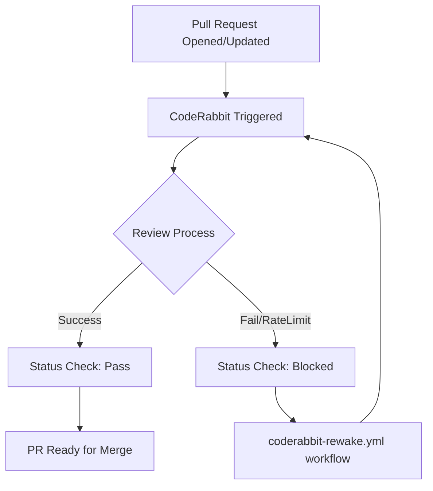
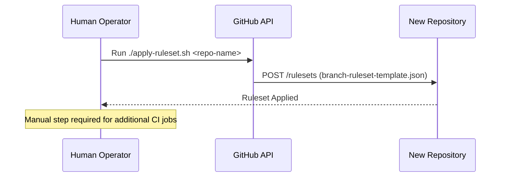

<details>
<summary>Relevant source files</summary>

The following files were used as context for generating this wiki page:

- [.coderabbit.yaml](.coderabbit.yaml)
- [README.md](README.md)
- [branch-ruleset-template.json](branch-ruleset-template.json)
- [apply-ruleset.sh](apply-ruleset.sh)
- [AGENTS.md](AGENTS.md)
- [SECURITY.md](SECURITY.md)
</details>

# CodeRabbit Integration Setup

CodeRabbit is integrated into the `repo-standard` framework to provide automated AI-driven code reviews for Pull Requests. The integration serves as a mandatory quality gate within the development workflow, ensuring that all code changes undergo automated scrutiny before they can be merged into the `main` branch.

Sources: [README.md:9](README.md#L9), [branch-ruleset-template.json:42-45](branch-ruleset-template.json#L42-L45)

## Architectural Role and Workflow

CodeRabbit operates as a "Required Status Check" within the GitHub repository structure. When a Pull Request is opened or updated, CodeRabbit performs an automated review. The integration is configured to block merges if the review process fails or is pending, necessitating its successful completion for project progress.

### Integration Flow
The following diagram illustrates how CodeRabbit fits into the standard Pull Request lifecycle:



The flow shows that CodeRabbit is a mandatory step, and specific workflows like `coderabbit-rewake.yml` exist to handle scenarios where reviews might get stuck.
Sources: [README.md:20-22](README.md#L20-L22), [README.md:38-40](README.md#L38-L40)

## Configuration and Quota Management

A critical aspect of the CodeRabbit setup is the management of the account-wide rate limit. The `blixten85` organization shares a Pro-plan quota of **5 reviews per hour** across all repositories.

### Rate Limit Mitigation Strategies
To prevent permanent PR blocks due to rate limits, the project implements several strategies:
*  **Staggered Schedules:** Repositories use specific time windows for Dependabot updates to avoid simultaneous PR generation.
*  **Update Grouping:** Patch and minor updates are consolidated into a single PR to minimize the number of required reviews.
*  **Rewake Workflow:** A specific `coderabbit-rewake.yml` workflow is included to re-trigger reviews if they are blocked by rate limiting.

| Strategy Component | Implementation Detail |
| :--- | :--- |
| **Org Quota** | 5 reviews/hour (Account-wide) |
| **Consolidation** | Grouping patch/minor updates into one PR |
| **Automation** | `coderabbit-rewake.yml` for stuck PRs |
| **Scheduling** | Unique 30-minute windows per repo |

Sources: [README.md:38-51](README.md#L38-L51), [README.md:20-22](README.md#L20-L22)

## Enforcement through Branch Rulesets

CodeRabbit is enforced at the repository level using GitHub Branch Rulesets. This ensures that the integration cannot be bypassed by automated agents or standard contributors.

### Ruleset Configuration
The `branch-ruleset-template.json` defines CodeRabbit as a strict requirement:

```json
{
  "type": "required_status_checks",
  "parameters": {
    "strict_required_status_checks_policy": true,
    "required_status_checks": [
      {
        "context": "CodeRabbit",
        "integration_id": 347564
      }
    ]
  }
}
```

Sources: [branch-ruleset-template.json:37-48](branch-ruleset-template.json#L37-L48)

### Deployment Script
The `apply-ruleset.sh` script is used to apply these rules to new repositories. Execution of this script is restricted to manual runs by human operators, as automated agents are explicitly forbidden from modifying GitHub organization settings or rulesets.



Sources: [apply-ruleset.sh:1-12](apply-ruleset.sh#L1-L12), [AGENTS.md:17-18](AGENTS.md#L17-L18)

## Integration Summary Table

| Component | File/Resource | Description |
| :--- | :--- | :--- |
| **Configuration** | `.coderabbit.yaml` | Main configuration file for CodeRabbit behavior. |
| **Enforcement** | `branch-ruleset-template.json` | Defines CodeRabbit (ID: 347564) as a required status check. |
| **Automation** | `coderabbit-rewake.yml` | Workflow to re-trigger stalled reviews. |
| **Setup Script** | `apply-ruleset.sh` | Shell script to push the ruleset configuration via GitHub API. |
| **Guidelines** | `README.md` | Details the rate-limit constraints and scheduling tables. |

Sources: [README.md:9](README.md#L9), [README.md:20](README.md#L20), [branch-ruleset-template.json:45](branch-ruleset-template.json#L45), [apply-ruleset.sh:9](apply-ruleset.sh#L9)

## Security and Compliance

CodeRabbit integration adheres to the project's security standards. While CodeRabbit reviews the code, it does not bypass security protocols such as the handling of secrets. All contributors are reminded that secrets should never be committed, and automated tools like Dependabot/CodeRabbit are monitored via security sync workflows.

Sources: [SECURITY.md:50-54](SECURITY.md#L50-L54), [README.md:18](README.md#L18)

In summary, the CodeRabbit Integration Setup is a multi-layered configuration involving YAML-based settings, GitHub Actions for resilience, and strict Branch Rulesets to ensure continuous, automated code quality assurance across the organization.
