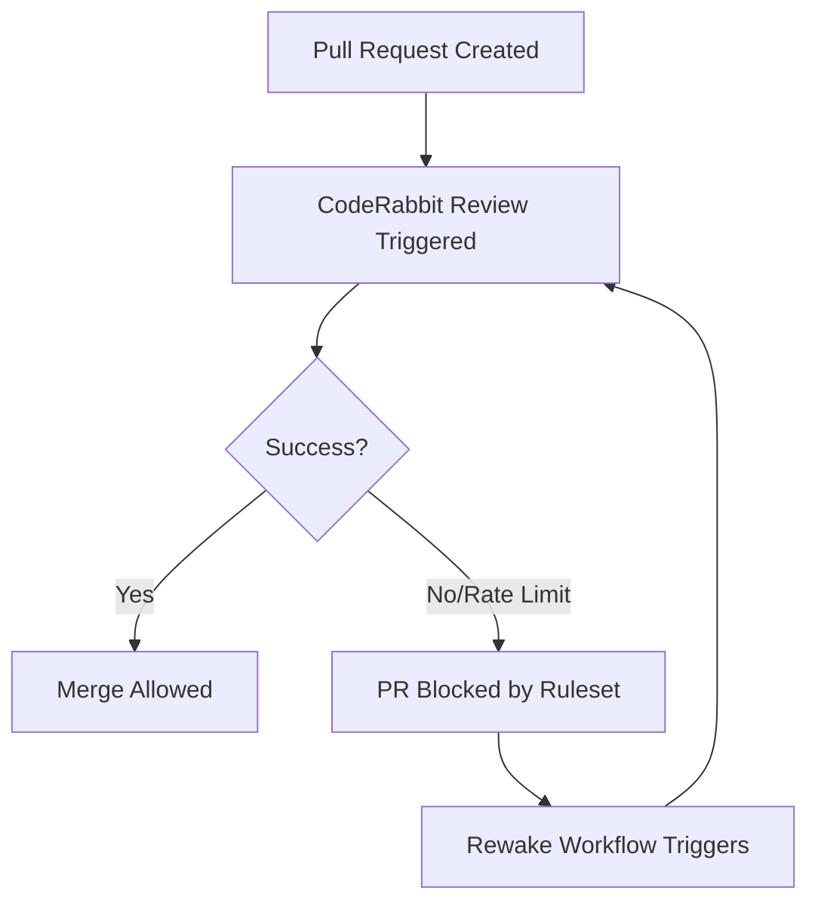

Relevant source files

The following files were used as context for generating this wiki page:

- [.github/workflows/coderabbit-rewake.yml](.github/workflows/coderabbit-rewake.yml)
- [README.md](README.md)
- [branch-ruleset-template.json](branch-ruleset-template.json)
- [AGENTS.md](AGENTS.md)
- [apply-ruleset.sh](apply-ruleset.sh)
- [SECURITY.md](SECURITY.md)

# CodeRabbit Rewake Workflow

The CodeRabbit Rewake Workflow is a critical automation component designed to handle rate-limiting issues encountered during automated code reviews. In the `blixten85` organization, CodeRabbit is configured as a **required status check** for Pull Requests (PRs). If a review is missed due to API rate limits, the PR remains permanently blocked from merging because the status check is never fulfilled.

This workflow serves as a trigger mechanism to re-initiate a review when a PR is stuck. It ensures that the development pipeline remains fluid despite the strict organizational quota of 5 reviews per hour across all repositories.

Sources: [README.md:27-29](README.md#L27-L29), [README.md:34-36](README.md#L34-L36), [branch-ruleset-template.json:43-49](branch-ruleset-template.json#L43-L49)

## The Rate Limit Challenge

The `blixten85` organization operates under a Pro-plan that limits reviews to **5 per hour** across the entire GitHub organization. This is not a per-repo limit and is not configurable via API. Because multiple repositories may trigger Dependabot updates simultaneously, the review quota is frequently exceeded.

Sources: [README.md:34-37](README.md#L34-L37)

### Impact on Pull Requests
When the limit is reached:
1.  CodeRabbit fails to post a review.
2.  The `CodeRabbit` status check remains in a pending or failed state.
3.  The branch protection rules (defined in `branch-ruleset-template.json`) prevent the PR from being merged.
4.  The system does not automatically retry the review once the quota resets.

Sources: [README.md:36](README.md#L36), [branch-ruleset-template.json:43-49](branch-ruleset-template.json#L43-L49)

## Workflow Architecture and Logic

The rewake workflow is part of a broader strategy to manage automated reviews alongside Dependabot scheduling. By staggering Dependabot windows across different repositories, the organization minimizes initial collisions, while the rewake workflow provides a fallback for when those collisions still occur.

### Integration with Branch Protection
The workflow is necessitated by the strict enforcement of status checks in the repository's ruleset.

*The diagram shows how the Rewake workflow acts as a recovery loop when the initial CodeRabbit status check fails.*

Sources: [branch-ruleset-template.json:43-50](branch-ruleset-template.json#L43-L50), [README.md:27-29](README.md#L27-L29)

### Status Check Configuration
The repository standard mandates that CodeRabbit must be satisfied for a merge to occur. This is enforced via the `required_status_checks` parameter.

| Parameter | Value | Description |
| :--- | :--- | :--- |
| `context` | `CodeRabbit` | The specific identifier for the status check. |
| `integration_id` | `347564` | The GitHub App ID for CodeRabbit. |
| `strict_required_status_checks_policy` | `true` | Requires branches to be up to date before merging. |

Sources: [branch-ruleset-template.json:43-51](branch-ruleset-template.json#L43-L51)

## Operations and Governance

### Manual Intervention and Scripts
While the rewake workflow automates the retry, the initial setup of these protections is restricted. The `apply-ruleset.sh` script is used to deploy these protections to new repositories, but it must be executed by a human operator, not an AI agent.

Sources: [apply-ruleset.sh:1-6](apply-ruleset.sh#L1-L6), [AGENTS.md:14-20](AGENTS.md#L14-L20)

### Dependency Scheduling Strategy
To prevent the Rewake workflow from being overwhelmed, repositories are assigned specific tidsfönster (time windows) for Dependabot updates.

| Repository | Scheduled Window (UTC/CET) |
| :--- | :--- |
| `bastion` | Wednesday 22:00–22:30 |
| `scraper` | Wednesday 23:00–23:30 |
| `repo-standard` | Wednesday 02:00–02:30 |
| `routines-relay` | Saturday 23:00–23:30 |

Sources: [README.md:46-59](README.md#L46-L59)

## Implementation Details

The rewake mechanism is defined in `.github/workflows/coderabbit-rewake.yml`. Its primary purpose is to "triggar om CodeRabbit-granskning på PR:er som fastnat" (re-trigger CodeRabbit reviews on stuck PRs).

Sources: [README.md:27-29](README.md#L27-L29)

### Required Capabilities for AI Agents
AI agents interacting with the repository are given specific instructions regarding Pull Requests and workflows to ensure they do not interfere with the rewake logic.

*  **Allowed:** Open PRs and run tests.
*  **Forbidden:** Disable workflows or push directly to `main`.
*  **Requirement:** Keep PRs focused to minimize unnecessary review cycles that consume the 5-review/hour quota.

Sources: [AGENTS.md:10-24](AGENTS.md#L10-L24)

## Summary
The CodeRabbit Rewake Workflow is an essential reliability feature in the `repo-standard` architecture. It bridges the gap between strict branch protection rules and external API rate limits, ensuring that the `blixten85` organization can maintain high security standards without manual bottlenecking of the CI/CD pipeline.
