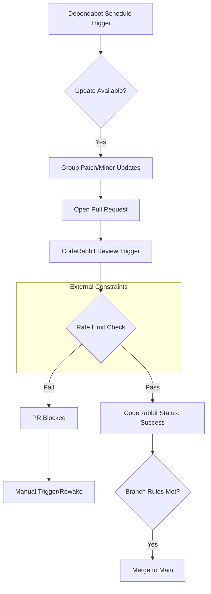

<details>
<summary>Relevant source files</summary>

The following files were used as context for generating this wiki page:

- [README.md](../../../README.md)
- [.github/dependabot.yml](../../../.github/dependabot.yml)
- [AGENTS.md](../../../AGENTS.md)
- [branch-ruleset-template.json](../../../branch-ruleset-template.json)
- [apply-ruleset.sh](../../../apply-ruleset.sh)
- [SECURITY.md](../../../SECURITY.md)
</details>

# Dependabot Configuration

Dependabot is a critical component of the `repo-standard` ecosystem, responsible for automated dependency management and security updates. It is integrated into the project's CI/CD lifecycle to ensure that GitHub Actions and third-party libraries remain up-to-date while navigating strict rate-limiting constraints imposed by external review tools like CodeRabbit.

Sources: [README.md:12](README.md#L12), [README.md:21-25](README.md#L21-L25)

## Core Objectives and Constraints

The primary objective of the Dependabot configuration is to automate updates for `github-actions` and other project dependencies. However, the implementation is heavily influenced by the CodeRabbit review quota, which is limited to 5 reviews per hour across the entire organization. To prevent Pull Requests (PRs) from being permanently blocked by a missed review, Dependabot is configured with specific scheduling windows and update grouping strategies.

Sources: [README.md:28-32](README.md#L28-L32), [README.md:34-40](README.md#L34-L40), [branch-ruleset-template.json:44-53](branch-ruleset-template.json#L44-L53)

### Dependency Update Workflow

The following diagram illustrates the flow from Dependabot triggering an update to the final merge, highlighting the interaction with CodeRabbit and branch protection rules.



This diagram shows the dependency update lifecycle and how external rate limits can block the automation pipeline.
Sources: [README.md:21-25](README.md#L21-L25), [README.md:34-40](README.md#L34-L40), [branch-ruleset-template.json:7-53](branch-ruleset-template.json#L7-L53)

## Scheduling and Resource Management

To avoid organizational rate limits, every repository must have a unique `schedule` window in its `.github/dependabot.yml`. These windows are consolidated to Wednesday and Saturday nights to minimize competition with the operator's manual usage and Claude API quotas.

### Organization Schedule Registry

| Repository | Update Window (UTC/CET) | Day |
|---|---|---|
| bastion | 22:00–22:30 | Wednesday |
| scraper | 23:00–23:30 | Wednesday |
| product-describer | 00:00–00:30 | Wednesday |
| ops-hub | 01:00–01:30 | Wednesday |
| repo-standard | 02:00–02:30 | Wednesday |
| docker-idempotent-update | 03:00–03:30 | Wednesday |
| plex_clear_watchlist | 04:00–04:30 | Wednesday |
| pastebinit | 22:00–22:30 | Saturday |
| routines-relay | 23:00–23:30 | Saturday |
| politiker-kontakter | 00:00–00:30 | Saturday |
| politiker-webapp | 01:00–01:30 | Saturday |
| filtered-movies | 02:00–02:30 | Saturday |
| product-describer-cloudflare | 03:00–03:30 | Saturday |

Sources: [README.md:43-57](README.md#L43-L57)

## Integration with Branch Protection

Dependabot PRs are subject to organizational branch protection rules defined in the `branch-ruleset-template.json`. These rules mandate that CodeRabbit must pass as a required status check before a merge can occur.

### Protection Rule Parameters

| Rule Type | Configuration | Description |
|---|---|---|
| Pull Request | `required_approving_review_count: 1` | At least one approval is required for merging. |
| Status Check | `context: "CodeRabbit"` | CodeRabbit review is a mandatory blocker. |
| Merge Methods | `squash`, `rebase` | Allowed methods for integrating updates. |
| Enforcement | `active` | Rules are applied to the `main` branch. |

Sources: [branch-ruleset-template.json:1-55](branch-ruleset-template.json#L1-L55)

## Implementation Configuration

The standard configuration for Dependabot focuses on `github-actions` updates and employs grouping to reduce the number of PRs generated.

```yaml
# Example derived from standard practices mentioned in documentation
version: 2
updates:
  - package-ecosystem: "github-actions"
    directory: "/"
    schedule:
      interval: "weekly"
      day: "wednesday"
      time: "02:00" # Unique for repo-standard
    groups:
      dependencies:
        patterns:
          - "*"
        update-types:
          - "patch"
          - "minor"
```

Sources: [README.md:12](README.md#L12), [README.md:38-40](README.md#L38-L40), [README.md:52](README.md#L52)

### Security Update Handling
While Dependabot handles general version updates, security vulnerabilities are addressed through the `security-alerts-sync.yml` workflow and the policies outlined in `SECURITY.md`. Vulnerabilities in third-party dependencies identified by Dependabot should be fixed based on severity, as tracked by the security response timeline.

Sources: [README.md:16](README.md#L16), [SECURITY.md:17-24](SECURITY.md#L17-L24), [SECURITY.md:41-42](SECURITY.md#L41-L42)

## Summary
The Dependabot configuration in this project is a balanced implementation designed to maintain up-to-date dependencies while operating within the specific technical constraints of the CodeRabbit review platform. By utilizing precise scheduling windows and grouping minor updates, the system ensures security and stability without triggering organizational rate limits.
