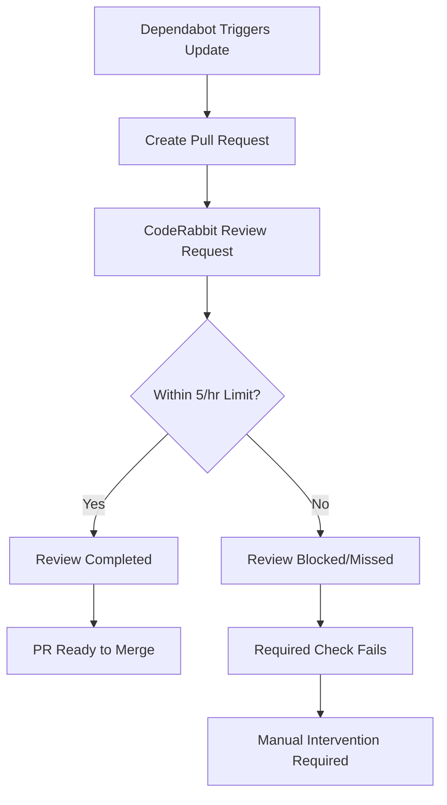
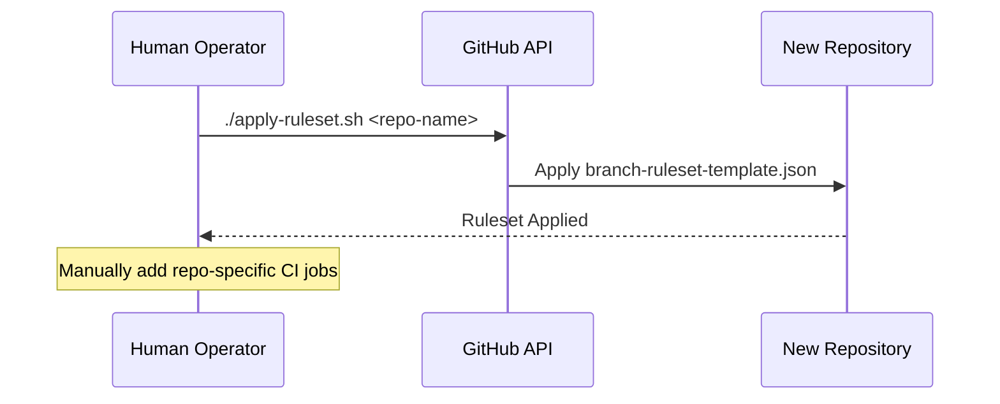

<details>
<summary>Relevant source files</summary>

The following files were used as context for generating this wiki page:

- [README.md](README.md)
- [SECURITY.md](SECURITY.md)
- [branch-ruleset-template.json](branch-ruleset-template.json)
- [apply-ruleset.sh](apply-ruleset.sh)
- [AGENTS.md](AGENTS.md)
- [CLAUDE.md](CLAUDE.md)
</details>

# Dependency Scheduling & Rate Limits

## Introduction
The `repo-standard` project implements a strict orchestration strategy for dependency updates and automated reviews to manage organizational rate limits. This system primarily addresses the constraints of the CodeRabbit Pro plan, which enforces a global limit of 5 reviews per hour across the entire GitHub organization. Without coordinated scheduling, concurrent automated Pull Requests (PRs) from multiple repositories can exceed this quota, leading to permanently blocked merges since CodeRabbit is configured as a required status check.

The scope of this system includes the configuration of Dependabot schedules, the grouping of updates to minimize PR volume, and the enforcement of branch protection rules that mandate successful automated reviews. By staggering update windows across different repositories, the project ensures continuous integration flow without manual intervention to re-trigger failed status checks.

Sources: [README.md:37-43](README.md#L37-L43), [branch-ruleset-template.json:44-52](branch-ruleset-template.json#L44-L52)

## CodeRabbit Rate Limit Constraints
The organization operates under a fixed quota for automated code reviews. As of July 2026, this limit is set to 5 reviews per hour for the entire blixten85 organization. This limit is shared across all repositories and is not configurable via API. Because CodeRabbit is a "required status check" in the branch ruleset, any PR that fails to receive a review due to rate limiting will block the merge process indefinitely unless manually re-triggered.

### Impact on CI/CD Flow
The following diagram illustrates the consequence of exceeding the rate limit during automated dependency updates:



*This flow shows how exceeding the organizational review limit results in a permanent block on the PR status.*
Sources: [README.md:37-43](README.md#L37-L43), [branch-ruleset-template.json:44-52](branch-ruleset-template.json#L44-L52)

## Staggered Scheduling Strategy
To mitigate rate limiting, the project employs a specific scheduling matrix. Dependency updates are consolidated into two primary nights: Wednesday and Saturday. This timing minimizes competition with daytime Claude AI quota usage by organization members. Furthermore, all patch and minor updates are grouped into a single PR per execution to reduce the total number of review requests.

### Repository Schedule Matrix
Each repository must be assigned a unique 30-minute window with a minimum 1-hour margin from neighboring slots.

| Repository | Scheduled Window | Day |
|---|---|---|
| bastion | 22:00 – 22:30 | Wednesday |
| scraper | 23:00 – 23:30 | Wednesday |
| product-describer | 00:00 – 00:30 | Wednesday |
| ops-hub | 01:00 – 01:30 | Wednesday |
| repo-standard | 02:00 – 02:30 | Wednesday |
| docker-idempotent-update | 03:00 – 03:30 | Wednesday |
| plex_clear_watchlist | 04:00 – 04:30 | Wednesday |
| pastebinit | 22:00 – 22:30 | Saturday |
| routines-relay | 23:00 – 23:30 | Saturday |
| politiker-kontakter | 00:00 – 00:30 | Saturday |

Sources: [README.md:45-64](README.md#L45-L64)

## Branch Protection and Status Checks
The project uses a branch ruleset template to enforce the dependency workflow. The `branch-ruleset-template.json` specifies that the `main` branch is protected, requiring at least one approving review and the successful completion of the CodeRabbit status check.

### Required Status Check Configuration
The ruleset identifies the CodeRabbit integration by its specific ID to ensure that only official reviews satisfy the merge requirement.

```json
{
  "type": "required_status_checks",
  "parameters": {
    "strict_required_status_checks_policy": true,
    "required_status_checks": [
      {
        "context": "CodeRabbit",
        "integration_id": 347564
      }
    ]
  }
}
```

Sources: [branch-ruleset-template.json:44-57](branch-ruleset-template.json#L44-L57)

### Deployment Logic
A shell script, `apply-ruleset.sh`, is used to programmatically apply these protections to new repositories. This action is explicitly restricted to human operators; AI agents are forbidden from modifying organization settings or branch protections to maintain security integrity.



*The deployment sequence ensures that branch protections are established before dependency automation begins.*
Sources: [apply-ruleset.sh:9-12](apply-ruleset.sh#L9-L12), [AGENTS.md:12-19](AGENTS.md#L12-L19)

## Automation Governance
The repository defines clear boundaries for AI agents (e.g., Claude) regarding the modification of these schedules and limits. While agents are allowed to modify code and open PRs, they are strictly forbidden from changing GitHub organization settings, disabling workflows, or pushing directly to protected branches.

### Agent Permissions Summary
| Category | Allowed Actions | Forbidden Actions |
|---|---|---|
| Development | Create branches, Modify code, Run tests, Open PRs | Push to main, Merge PRs, Delete branches |
| Infrastructure | None | Disable workflows, Modify secrets, Change Org settings |

Sources: [AGENTS.md:9-19](AGENTS.md#L9-L19), [SECURITY.md:27-30](SECURITY.md#L27-L30)

## Conclusion
The dependency scheduling system in `repo-standard` is a critical component for maintaining CI/CD stability within the blixten85 organization. By strictly staggering Dependabot windows and grouping updates, the project stays within the 5 reviews/hour CodeRabbit limit, preventing automated PRs from becoming permanently blocked. This coordination, combined with robust branch protection rules and clear agent governance, ensures a predictable and secure update lifecycle for all repositories following this standard.

Sources: [README.md:37-43](README.md#L37-L43), [README.md:68-80](README.md#L68-L80)
