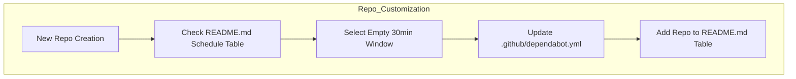
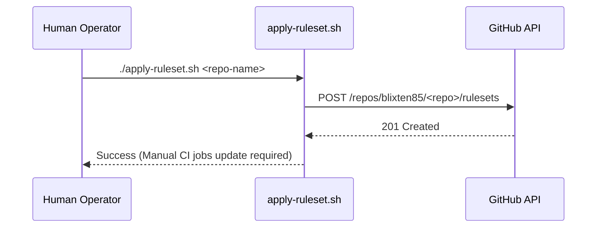

<details>
<summary>Relevant source files</summary>

The following files were used as context for generating this wiki page:

- [README.md](../../../README.md)
- [SECURITY.md](../../../SECURITY.md)
- [CLAUDE.md](../../../CLAUDE.md)
- [AGENTS.md](../../../AGENTS.md)
- [branch-ruleset-template.json](../../../branch-ruleset-template.json)
- [apply-ruleset.sh](../../../apply-ruleset.sh)
</details>

# Customizing Template Functionality

Customizing template functionality within the `repo-standard` ecosystem involves adapting a "gold standard" repository structure to specific project needs. The template provides a foundational set of GitHub Actions, security policies, and AI agent instructions that require manual configuration to ensure operational stability and compliance with organizational standards.

The customization process primarily focuses on three areas: configuring AI agent behavior via specialized Markdown guides, establishing unique maintenance windows to manage resource quotas, and applying branch protection rulesets through automated scripts and manual API adjustments.

Sources: [README.md:1-6](../../../README.md#L1-L6), [CLAUDE.md](../../../CLAUDE.md), [AGENTS.md](../../../AGENTS.md)

## AI Agent Configuration

The repository includes template files for AI agents, specifically `CLAUDE.md` and `AGENTS.md`. These files serve as the primary interface for defining repo-specific conventions and operational constraints for AI tools.

### Placeholders and Conventions
Developers must replace placeholders like `<repo-name>` and define specific build tools, testing requirements, and directory structures. This ensures that agents like Claude operate within the expected technical context of the new repository.

Sources: [README.md:12](../../../README.md#L12), [CLAUDE.md:1-7](../../../CLAUDE.md#L1-L7), [AGENTS.md:1-7](../../../AGENTS.md#L1-L7)

### Permission Boundaries
`AGENTS.md` explicitly defines what AI agents are permitted to do versus actions that are strictly forbidden.

| Category | Allowed Actions | Forbidden Actions |
| :--- | :--- | :--- |
| **Development** | Create branches, modify code, run tests, open PRs | Push to main/master, merge PRs, delete branches |
| **Infrastructure** | N/A | Disable workflows, modify secrets, change org settings |

Sources: [AGENTS.md:9-20](../../../AGENTS.md#L9-L20)

## Dependency Maintenance & Rate Limiting

A critical customization step involves the `.github/dependabot.yml` configuration. The `blixten85` organization shares a CodeRabbit Pro plan, which enforces a global limit of 5 reviews per hour across all repositories.

### Scheduling Strategy
To prevent Dependabot updates from triggering simultaneous CodeRabbit reviews and hitting the rate limit, each repository must be assigned a unique 30-minute time window. Updates are consolidated to Wednesday and Saturday nights to minimize competition with manual development activity.



Sources: [README.md:27-42](../../../README.md#L27-L42), [README.md:65-67](../../../README.md#L65-L67)

### Maintenance Windows Example
| Day | Time Window | Repository |
| :--- | :--- | :--- |
| Wednesday | 02:00–02:30 | repo-standard |
| Saturday | 22:00–22:30 | pastebinit |

Sources: [README.md:47-57](../../../README.md#L47-L57)

## Branch Protection and Rulesets

The template uses a JSON-based ruleset to protect the `main` branch. This functionality is deployed using a shell script that interacts with the GitHub REST API.

### Ruleset Deployment Flow
The `apply-ruleset.sh` script automates the creation of the ruleset. However, because branch protection changes are blocked for AI agents, this script must be executed manually by a human operator.



Sources: [apply-ruleset.sh:1-12](../../../apply-ruleset.sh#L1-L12)

### Ruleset Parameters
The standard ruleset (`branch-ruleset-template.json`) enforces specific requirements for PRs targeting the `main` branch:
- **Required Reviews**: 1 approving review.
- **Status Checks**: CodeRabbit (Integration ID: 347564) is required by default.
- **Merge Methods**: Only `squash` and `rebase` are allowed.
- **Protection**: Deletions and non-fast-forward pushes are prohibited.

Sources: [branch-ruleset-template.json:10-53](../../../branch-ruleset-template.json#L10-L53)

### Manual CI Extensions
After the initial application, developers must manually add project-specific CI job names (e.g., `lint`, `test`) to the `required_status_checks` list. This requires fetching the current ruleset JSON, editing the `rules[].parameters.required_status_checks` array to include the new job contexts, and then pushing the updated ruleset back using the full JSON payload:

```bash
# Fetch the current ruleset
gh api repos/blixten85/<repo>/rulesets/<id> > ruleset.json

# Edit ruleset.json to add your CI job names to rules[].parameters.required_status_checks

# Apply the updated ruleset
gh api --method PUT repos/blixten85/<repo>/rulesets/<id> --input ruleset.json
```

Sources: [README.md:70-72](../../../README.md#L70-L72), [apply-ruleset.sh:13-15](../../../apply-ruleset.sh#L13-L15)

## Security and Sensitive Data Handling

Template customization also involves adhering to the security protocols defined in `SECURITY.md`. This includes ensuring that OAuth implementations remain PKCE-based and that internal encryption components (such as `SyncCrypto.swift` or `Keychain.swift` in relevant applications) are correctly configured.

### Prohibited Configurations
- **Secrets**: Never commit client secrets, tokens, or passphrases to the repository.
- **OAuth**: The client should only carry a public client ID in `App/OAuthProviders.swift`.

Sources: [SECURITY.md:43-52](../../../SECURITY.md#L43-L52)

## Summary
Customizing the `repo-standard` template is a manual process that ensures every repository in the organization follows a unified automation and security pattern while avoiding shared resource exhaustion. By configuring agent guides, specific maintenance schedules, and robust branch rulesets, the project maintains a "gold standard" for development and security.

Sources: [README.md:1-5](../../../README.md#L1-L5), [README.md:60-75](../../../README.md#L60-L75)
