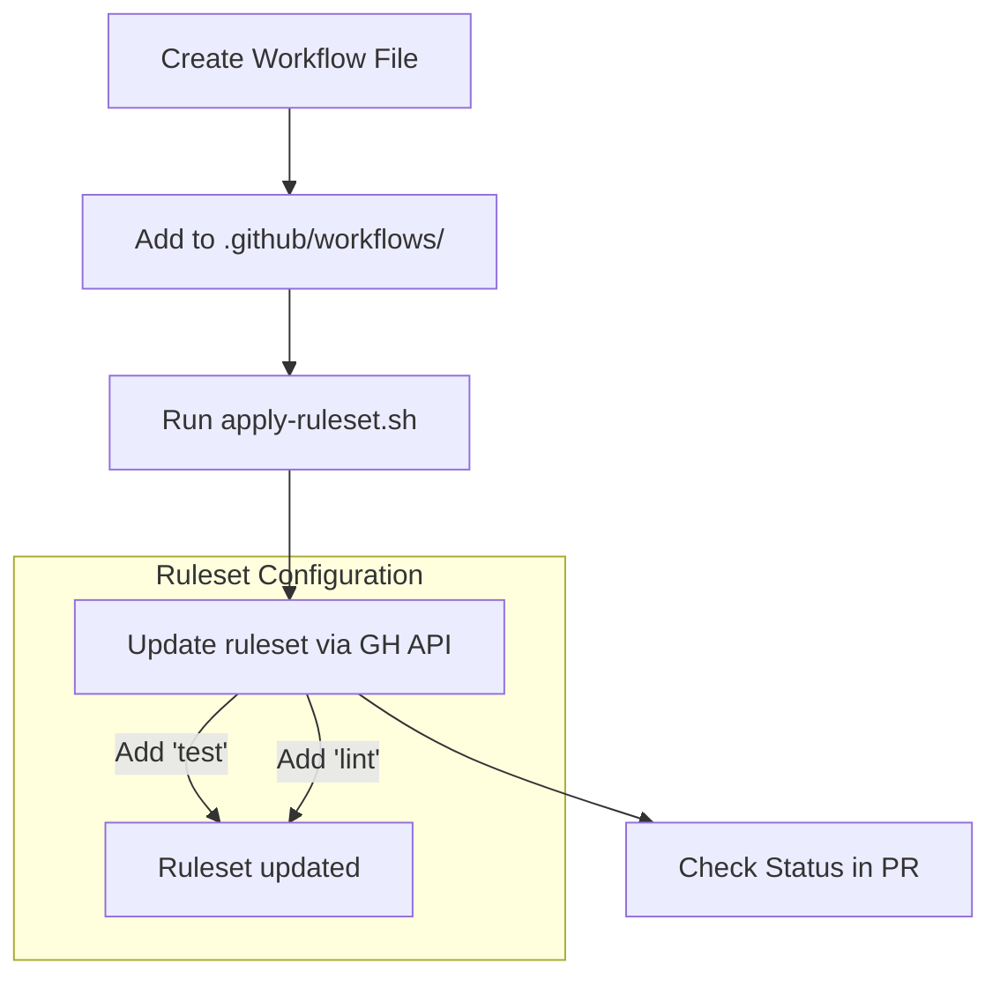
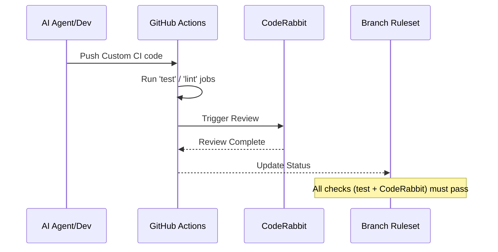

<details>
<summary>Relevant source files</summary>

The following files were used as context for generating this wiki page:

- [README.md](../../../README.md)
- [branch-ruleset-template.json](../../../branch-ruleset-template.json)
- [apply-ruleset.sh](../../../apply-ruleset.sh)
- [AGENTS.md](../../../AGENTS.md)
- [CLAUDE.md](../../../CLAUDE.md)
- [SECURITY.md](../../../SECURITY.md)
</details>

# Adding Custom CI Checks

## Introduction
The `repo-standard` framework provides a foundation for maintaining consistent CI/CD practices across all organization repositories. While the project includes several standard workflows, it is designed to be extensible, allowing developers to add project-specific CI checks such as builds, tests, and linters. These custom checks are integrated into the repository's protection logic to ensure that code quality is maintained before any changes are merged into the `main` branch.

Sources: [README.md:1-5](../../../README.md#L1-L5), [README.md:23-28](../../../README.md#L23-L28)

Adding custom CI checks involves two main phases: defining the workflow logic in a GitHub Actions YAML file and enforcing those checks through the repository's branch rulesets. This process ensures that the "gold standard" is maintained while accommodating the unique requirements of different software projects.

Sources: [README.md:29-33](../../../README.md#L29-L33), [apply-ruleset.sh:12-14](../../../apply-ruleset.sh#L12-L14)

## Implementation Workflow

### 1. Creating the CI Workflow
Custom CI workflows should be added to the `.github/workflows/` directory. These workflows typically handle tasks like running unit tests, performing static analysis (linting), or verifying type safety. These are distinct from the standard automation workflows provided by the template.

Sources: [README.md:29-30](../../../README.md#L29-L30), [apply-ruleset.sh:14](../../../apply-ruleset.sh#L14)

### 2. Registering Required Status Checks
Once a custom workflow is created, its job names must be registered as "Required Status Checks" within the GitHub branch ruleset. This prevents Pull Requests from being merged if the custom checks fail.

The standard template initially only enforces `CodeRabbit` as a required check. Developers must manually update the ruleset to include their specific job names (e.g., 'lint', 'test', 'typecheck').

Sources: [branch-ruleset-template.json:44-50](../../../branch-ruleset-template.json#L44-L50), [apply-ruleset.sh:12-14](../../../apply-ruleset.sh#L12-L14)



The diagram shows the process of adding a custom CI check, from file creation to manual API updates for ruleset enforcement.
Sources: [README.md:78-85](../../../README.md#L78-L85), [apply-ruleset.sh:1-15](../../../apply-ruleset.sh#L1-L15)

## Enforcement and Rulesets

The project uses a JSON template to define branch protection rules for the `main` branch. This template includes requirements for pull requests, such as approving reviews and resolved threads, in addition to status checks.

### Ruleset Template Structure
| Key | Value/Effect |
|:---|:---|
| `name` | "Protect main" |
| `enforcement` | "active" |
| `required_approving_review_count` | 1 |
| `strict_required_status_checks_policy` | true |
| `required_status_checks` | List of job names that must pass |

Sources: [branch-ruleset-template.json:2-49](../../../branch-ruleset-template.json#L2-L49)

### Applying and Modifying Rules
Rulesets are applied using the `apply-ruleset.sh` script. However, because branch protection changes are restricted for AI agents, this must be performed by a human operator.

```bash
# Applying the initial template
./apply-ruleset.sh <repo-name>

# Manually adding custom checks to the existing ruleset
# First, fetch the current ruleset
gh api repos/blixten85/<repo>/rulesets/<id> > ruleset.json

# Edit ruleset.json to add custom CI job names to rules[].parameters.required_status_checks

# Apply the updated ruleset with the full JSON body
gh api --method PUT repos/blixten85/<repo>/rulesets/<id> --input ruleset.json
```

Sources: [apply-ruleset.sh:1-11](../../../apply-ruleset.sh#L1-L11), [README.md:82-84](../../../README.md#L82-L84)

## Agent Permissions and CI
The interaction between AI agents and CI checks is strictly governed. While agents are allowed to run tests and open PRs, they are forbidden from modifying the CI workflows themselves or changing GitHub organization settings.

| Action | Agent Permission |
|:---|:---|
| Create branches | Allowed |
| Run tests | Allowed |
| Modify workflows | Forbidden |
| Push to main | Forbidden |

Sources: [AGENTS.md:7-22](../../../AGENTS.md#L7-L22)

## Integration with CodeRabbit
One critical aspect of the CI environment is the CodeRabbit integration. CodeRabbit is configured as a required status check in the standard ruleset. Because CodeRabbit has organization-wide rate limits (5 reviews per hour), custom CI schedules must be carefully managed in `dependabot.yml` to avoid blocking PRs permanently.



The sequence diagram illustrates how custom jobs and integrated services like CodeRabbit must both succeed to satisfy the branch ruleset.
Sources: [README.md:34-40](../../../README.md#L34-L40), [branch-ruleset-template.json:44-50](../../../branch-ruleset-template.json#L44-L50)

## Conclusion
Adding custom CI checks in a `repo-standard` compliant repository is a multi-step process that combines automated workflow execution with manual security enforcement. By adding project-specific jobs to the `required_status_checks` list, teams ensure that the unique quality requirements of their software are met without compromising the organization's standard protection rules.

Sources: [README.md:29-33](../../../README.md#L29-L33), [apply-ruleset.sh:12-14](../../../apply-ruleset.sh#L12-L14)
